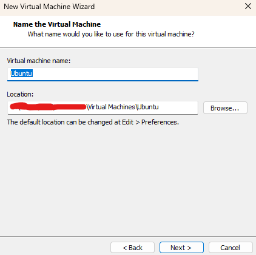
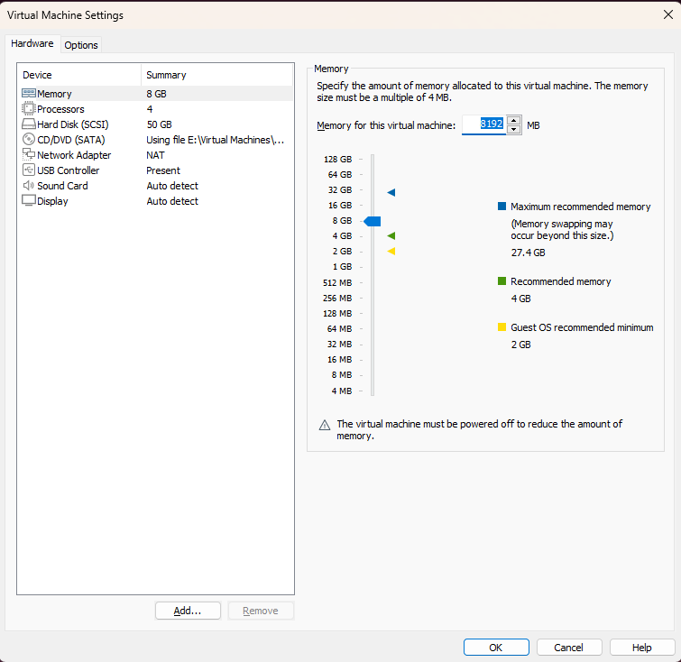
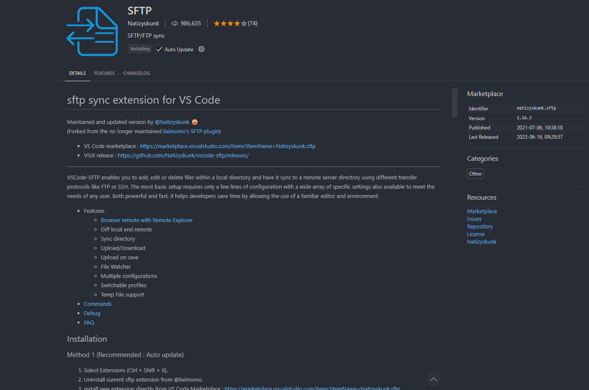
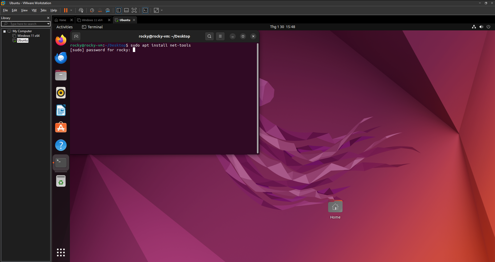
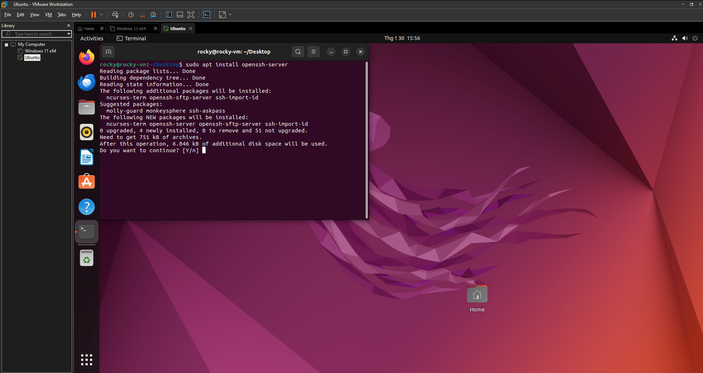
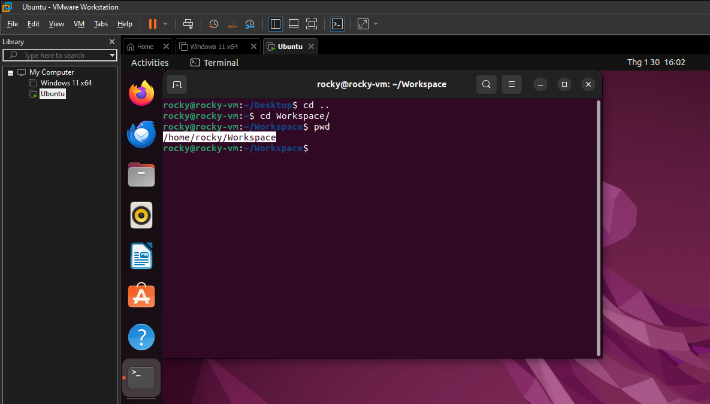
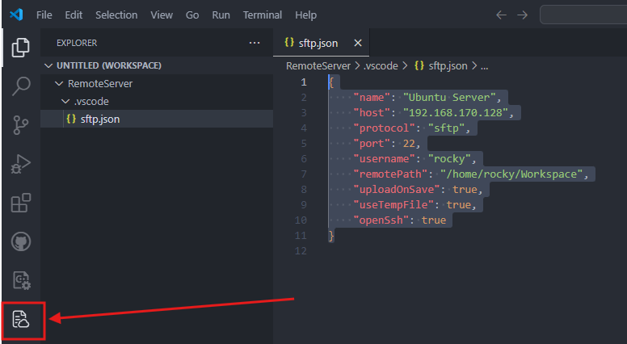
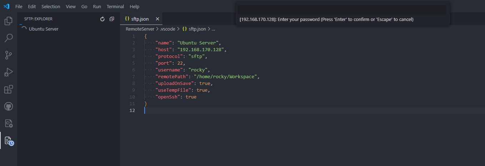
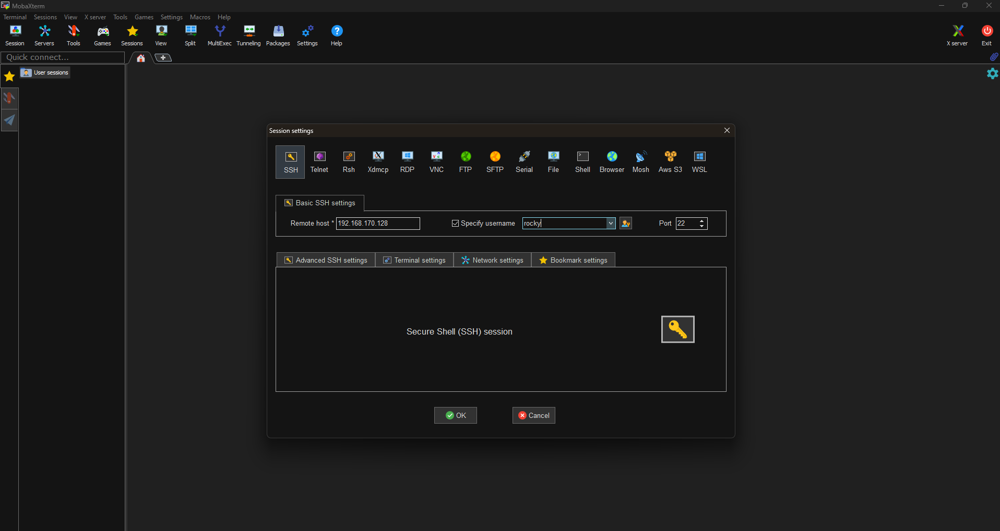
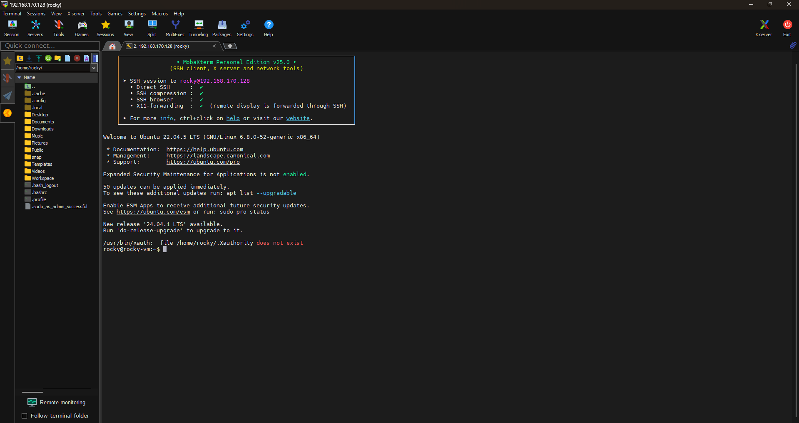

# Lession 0 - Setting up Environment

## 1 - Download and install software
- [VMware Workstation Pro](https://support.broadcom.com/group/ecx/productdownloads?subfamily=VMware+Workstation+Pro)
- [Ubuntu LTS 22.04](https://releases.ubuntu.com/22.04/)
- [Visual Studio Code](https://code.visualstudio.com/)
- [MobaXterm Home Edition](https://mobaxterm.mobatek.net/download-home-edition.html)

### **Step 1**
- Install VMware Workstation Pro, Visual Studio Code and MobaXterm Home Edition on local PC.

### **Step 2**
- Launch VMware Workstation Pro, click File -> New Virtual Machine to create a new virtual machine.
- When setting up for the new virtual machine, keep all settings as default. We will change them latter on.
- Make sure to choose the right location to save our virtual machine (VM)  


### **Step 3**
- After installation, right click on the VM name that we have just created, then click Settings
    - At Memory section, this will be our RAM memory. We can choose 8GB so that our VM has good performance.  
  
    - At Processor section, this setting depends on our physical PC. A good rule is to allocate half or fewer cores to keep the system balanced.  

| Host CPU	      | Suggested VM Setting |
| ----------- | ----------- |
| 4 Cores	      | 2 processors, 2 cores each       |
| 8 Cores	   | 2 processors, 4 cores each        |
| 12+ Cores | 4 processors, 3 cores each|

A computer usually has one physical processor chip (or 1 CPU) (Sometimes more in high-end systems). A core is like a smaller, independent processor inside the main processor. Each core can work on a different task at the same time, making your computer faster and more efficient.  
So if I run command **dxdiag** in my physical PC and I see 12 CPUs, this means actually I only have 1 CPU (or processor chip), but my CPU has 6 cores, each has 2 threads. So my Windows detects 6 Cores x 12 threads = 12 logical processors (CPUs in **dxdiag**).  
In VMware, it lets us simulate multiple processors even though we only have 1 processor in physical machine. It does this by splitting our CPU cores to virtual CPUs (vCPUs) for the VM. So if we set 4 processors in VMware, the software will divide the CPU resources of our real machine to simulate 4 CPU sockets inside the VM. Each of these virtual processors (vCPUs) will use some of our real CPU's cores/threads to do the work.  
    - At Hard Disk (SCSI) section, find Disk Utilities -> Expand disk capacity -> Expand, assign 50GB to the VM.
    - At CD/DVD (SATA) section, find Connection -> Use ISO image file and select the .iso file of Ubuntu LTS 22.04 that we downloaded.
- Click OK.

### **Step 4**  
- Start the VM and install Ubuntu

## 2 - Network protocol
### 2.1 - SSH  
- SSH (Secure Shell) is a network protocol used to securely connect to and control remote computers over the internet or a local network. It allows users to log into another computer and execute commands as if they were sitting in front of it.  
    - Secure Communication: Encrypts all data (unlike older protocols like Telnet).
    - Remote Access: Control servers/computers from anywhere.
    - File Transfer: Supports secure file transfer via SCP or SFTP.
    - Tunneling & Port Forwarding: Can secure other connections (like database access).
### 2.2 - SFTP
- SFTP (Secure File Transfer Protocol) is a secure way to transfer files between computers over a network. It works like FTP (File Transfer Protocol) but with encryption, making it much safer.
    - SFTP runs over SSH (Secure Shell), so all file transfers are encrypted.
    - You need an SFTP client (software) to connect to an SFTP server and transfer files.
### 2.3 - Using VSCode to connect to VM
- In our case, we can consider the VM that we have just created is a server machine running linux and our Windows machine is a host machine. We can use the host machine to connect to server machine and work on it using SSH. We can also use SFTP for file transfer.  

#### **Step 1**
- Open Visual Studio Code, then install extention SFTP  
  

#### **Step 2**
- Create a new folder in the host machine.
- In Visual Studio Code, click File -> Add Folder to Workspace, and open the new folder that we have just created.
- In VSCode, press Ctrl+Shift+p combination, then type SFTP in the search bar. Click SFTP Config, a file called sftp.json opens.
- On VM running Ubuntu, open Terminal, then type the command ```sudo apt install net-tools``` to install net-tools.  
  
- After installation finished, type the command ```ifconfig```, the Terminal will show network information of VM. At ens33, copy the IP address at inet line.  
- On Windows machine, open Command Prompt. Then type the command ```ping <IPaddress of ubuntu machine>```. If we can see responses from that IP address, it means that we have connection between the 2 machines.
- On VM, type the command ```sudo apt install openssh-server -y```
  

#### **Step 3**
- In VSCode, sftp.json file, at name section, we will name our server. Host section, we will replace localhost by IP address of the server, which is the IP address from Ubuntu server. Username will be the username of the Ubuntu VM. Path will be the folder location of VM that we want to connect to.  
  
- The rest of the setting can be set to true, then save the json file.
```json
{
    "name": "Ubuntu Server",
    "host": "192.168.170.128",
    "protocol": "sftp",
    "port": 22,
    "username": "rocky",
    "remotePath": "/home/rocky/Workspace",
    "uploadOnSave": true,
    "useTempFile": true,
    "openSsh": true
}
```
- After saving json file, on the right side of the VSCode window, there is a small SFTP icon  
  
- After clicking on that SFTP icon, a new window will open with a line named Ubuntu Server, double click on that and enter password of Ubuntu Server and we will create a connection to specified folder of Ubuntu.
  

#### **Step 4**
- Another way to connect to Ubuntu VM is using MobaXterm.
- Open MobaXterm, click Session -> SSH.
- In SSH window, type IP address of Ubuntu VM and username of the VM, then click OK  
  
- We will have access to all files of VM and run command directly from MobaXterm  
  

