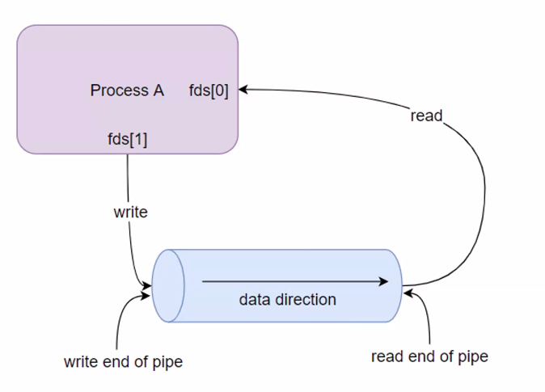
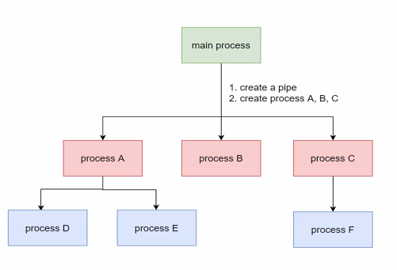
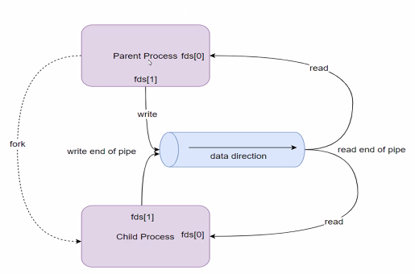
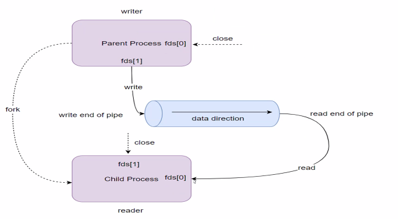
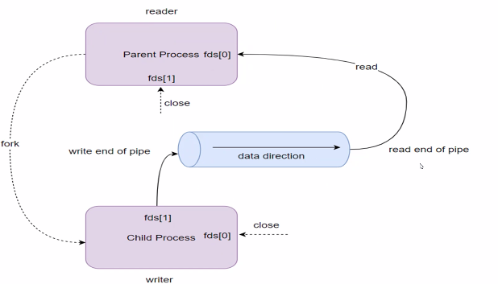

# Lesson 7 - Pipes and FIFO

## 1 - Introduction

A pipe is like a one-way communication tube between two processes. One process writes data into one end, and another process reads it from the other end—think of it as a water pipe where water flows in one direction.

It’s a simple way for processes to share information, like passing notes through a tunnel.



Types:
- Unnamed Pipes: Temporary, created with pipe()—used between related processes (e.g., parent and child).
- Named Pipes (FIFO): Persistent, created with mkfifo()—used between unrelated processes via a file name.

How Do Pipes Work?
- File Descriptors: A pipe gives you two ends:
    - Write end (e.g., `fd[1]`): Where data is sent.
    - Read end (e.g., `fd[0]`): Where data is received.
- One-Way: Data flows from write end to read end—can’t go back without a second pipe.
- Blocking:
    - Reading waits if the pipe is empty.
    - Writing waits if the pipe is full (has a size limit, e.g., 64KB on Linux).

Key Functions (Unnamed Pipes)
- `int pipe(int fd[2])`:
    - Creates a pipe.
    - `fd[0]`: Read end.
    - `fd[1]`: Write end.
- `write(int fd, const void *buf, size_t count)`: Writes data to the pipe.
- `read(int fd, void *buf, size_t count)`: Reads data from the pipe.
- `close(int fd)`: Closes a pipe end when done.

Example 1:

```c
#include <stdio.h>
#include <stdlib.h>
#include <unistd.h>
#include <string.h>

int main() {
    int pipe_fd[2]; // Array for pipe file descriptors
    pid_t pid;
    char buffer[50];
    const char* message = "Hello from parent!";

    // Create the pipe
    if (pipe(pipe_fd) == -1) {
        perror("Pipe failed");
        exit(1);
    }

    // Fork to create a child process
    pid = fork();

    if (pid < 0) { // Fork failed
        perror("Fork failed");
        exit(1);
    }

    if (pid > 0) { // Parent process
        // Close read end (parent only writes)
        close(pipe_fd[0]);

        // Write message to pipe
        write(pipe_fd[1], message, strlen(message) + 1); // +1 for null terminator
        printf("Parent: Sent message to child\n");

        // Close write end
        close(pipe_fd[1]);

        // Wait for child to finish
        wait(NULL);
    } else { // Child process
        // Close write end (child only reads)
        close(pipe_fd[1]);

        // Read from pipe
        read(pipe_fd[0], buffer, sizeof(buffer));
        printf("Child: Received message: %s\n", buffer);

        // Close read end
        close(pipe_fd[0]);
        exit(0);
    }

    return 0;
}
```

A pipe acts like a temporary “file” in memory—a virtual file—that doesn’t live on disk but exists in the system’s RAM as a buffer (a small storage space).

Virtual: It’s not a real file you can see in a directory—it’s a kernel-managed buffer for transferring data between processes. Treated like a file in code (using read()/write()), but it’s not stored on disk—it’s a live, in-memory channel managed by the operating system.




Related process: Processes with a parent-child relationship, created using `fork()`.

`fork()` duplicates the parent’s resources (like pipe file descriptors), so both processes inherit access to the same pipe.

- Use `pipe()` before `fork()`—sets up the virtual file and gives both ends to the parent.
- Child gets a copy of the pipe’s file descriptors.
- One process writes, the other reads—close unused ends.

Unrelated process: Processes not created by fork()—independent programs (e.g., two separate terminal commands). 

No shared inheritance like fork(), so they need a named connection point.

- Use mkfifo() to create a named pipe—a special file in the filesystem (still virtual, but with a name).
- Processes open this file by name using standard file operations (open(), read(), write()).
- Still one-way—decide which process writes and which reads.

### Blocking behavior
- Reading: If the pipe is empty (no data written yet), read() waits (blocks) until data arrives.
- Writing: If the pipe’s buffer is full (e.g., 64KB limit on Linux), write() waits until space is freed (by reading).

The pipe is a virtual file—a buffer (temporary storage) managed by the operating system’s kernel in memory (RAM), not on disk.

- When you create a pipe with pipe(), the kernel allocates a fixed-size buffer (e.g., 64KB on Linux).
- Data written to the pipe goes into this buffer.
- Data read from the pipe comes from this buffer—it’s a live, in-memory channel.

Unlike regular files, there’s no physical storage—it exists only while the pipe is open.

## 2 - Creating and using Pipes

A two-way pipe means bidirectional communication—two processes can send data to each other, not just one-way like a single pipe.

Use two separate pipes:
- Pipe 1: Process A writes, Process B reads.
- Pipe 2: Process B writes, Process A reads



### Two-way pipe: Parent is writer, child is reader



### Two-way pipe: Parent is writer, child is reader



Example 1

```c
#include <stdio.h>
#include <stdlib.h>
#include <unistd.h>
#include <string.h>

int main() {
    int parent_to_child[2]; // Pipe 1: Parent writes, Child reads
    int child_to_parent[2]; // Pipe 2: Child writes, Parent reads
    pid_t pid;
    char buffer[50];

    // Create two pipes
    if (pipe(parent_to_child) == -1 || pipe(child_to_parent) == -1) {
        perror("Pipe failed");
        exit(1);
    }

    // Fork to create child
    pid = fork();
    if (pid < 0) {
        perror("Fork failed");
        exit(1);
    }

    if (pid > 0) { // Parent
        // Close unused ends
        close(parent_to_child[0]); // Won’t read from Pipe 1
        close(child_to_parent[1]); // Won’t write to Pipe 2

        // Write to child
        const char* parent_msg = "Hello from parent!";
        write(parent_to_child[1], parent_msg, strlen(parent_msg) + 1);
        printf("Parent: Sent '%s'\n", parent_msg);

        // Read from child
        read(child_to_parent[0], buffer, sizeof(buffer));
        printf("Parent: Received '%s'\n", buffer);

        // Close used ends
        close(parent_to_child[1]);
        close(child_to_parent[0]);
        wait(NULL); // Wait for child
    } else { // Child
        // Close unused ends
        close(parent_to_child[1]); // Won’t write to Pipe 1
        close(child_to_parent[0]); // Won’t read from Pipe 2

        // Read from parent
        read(parent_to_child[0], buffer, sizeof(buffer));
        printf("Child: Received '%s'\n", buffer);

        // Write to parent
        const char* child_msg = "Hi back from child!";
        write(child_to_parent[1], child_msg, strlen(child_msg) + 1);
        printf("Child: Sent '%s'\n", child_msg);

        // Close used ends
        close(parent_to_child[0]);
        close(child_to_parent[1]);
        exit(0);
    }

    return 0;
}
```

Example 2:

```c
#include <stdlib.h>
#include <stdio.h>
#include <unistd.h>
#include <signal.h>

#define MSG_SIZE    20

char *msg1 = "hello, world #1";
char *msg2 = "hello, world #2";
char *msg3 = "hello, world #3";
char *msg4 = "hello, world #4";

char pipe_buff[MSG_SIZE];
int fds[2], i;

void sig_handler1(int num)
{
	printf("Im signal handler1: %d\n", num);
	write(fds[1], msg4, MSG_SIZE);
}

int main(int argc, char const *argv[])
{
    /* code */

    if (signal(SIGINT, sig_handler1) == SIG_ERR) {
   	 	fprintf(stderr, "Cannot handle SIGINT\n");
   	 	exit(EXIT_FAILURE);
    }

    if (pipe(fds) < 0) {
        printf("pipe() unsuccessfully\n");
        exit(1);
    }

    //write(fds[1], msg1, MSG_SIZE);
    //write(fds[1], msg2, MSG_SIZE);
    //write(fds[1], msg3, MSG_SIZE); 
    //printf("sleep 2 seconds\n");
    //sleep(2);

    read(fds[0], pipe_buff, MSG_SIZE);
    printf("msg[%d]: %s\n", 1, pipe_buff);

    //for (i = 0; i < 3; i++) {
    //    read(fds[0], pipe_buff, MSG_SIZE);
    //    printf("msg[%d]: %s\n", i+1, pipe_buff);
    //}

    return 0;
}
```

Related pipe example:

```c
#include <stdio.h>
#include <stdlib.h>
#include <unistd.h>
#include <signal.h>
#include <sys/types.h>
#include <sys/wait.h>

#define MSG_SIZE    16

char *msg1 = "hello, world #1";
char *msg2 = "hello, world #2";
char *msg3 = "hello, world #3";

static void func(int signum)
{
    wait(NULL); 
    printf("child process termination\n");
}

int main(int argc, char const *argv[])
{
    /* code */
    char in_buff[MSG_SIZE];
    int num_read = 0;
    int fds[2];
    pid_t child_pid;

    if (pipe(fds) < 0) {
        printf("pipe() unsuccessfully\n");
        exit(1);
    }

    child_pid = fork();
    if (child_pid >= 0) {
        if (child_pid == 0) {
            // Do something
            printf("I am Child\n"); // reader
            //if (close(fds[1]) == -1) // write end is unused
            //    printf("close(fds[1]) failed\n");
            
            // Suspend if no data
            while (1 ) {
                num_read = read(fds[0], in_buff, MSG_SIZE);
                if (num_read == -1) {
                    printf("read() failed\n");
                    exit(0);
                } else if (num_read == 0) {
                    printf("pipe end-of-pipe\n");
                    break;
                } else {
                    printf("msg: %s\n", in_buff);
                }
            };

        } else { 
            // Prevent zombie process 
            signal(SIGCHLD, func);

            printf("I am Parent\n"); // writer
            if (close(fds[0]) == -1) // read end is unused
                printf("close(fds[0]) failed\n");

            // Write into pipe
            write(fds[1], msg1, MSG_SIZE);
            write(fds[1], msg2, MSG_SIZE);
            write(fds[1], msg3, MSG_SIZE);

            if (close(fds[1]) == -1) // reader will see end-of-pipe
                printf("close(fds[0]) failed\n");
            while(1);
        }
    } else {
        printf("fork() unsuccessfully\n");
    }

    return 0;
}
```

Pipe end-of-file (EOF) is a signal that there’s no more data to read from a pipe because the write end has been closed—like reaching the end of a book or a stream drying up.

In a pipe, EOF doesn’t mean the pipe itself is gone; it means no more writing will happen, so reading finishes.

- If the write end is open, read() waits (blocks) if the pipe is empty.
- If the write end is closed and the pipe is empty, read() returns 0—no waiting, just “done.”

Example:

```c
#include <stdio.h>
#include <stdlib.h>
#include <unistd.h>
#include <string.h>

int main() {
    int pipe_fd[2]; // Pipe file descriptors
    pid_t pid;
    char buffer[50];

    // Create pipe
    if (pipe(pipe_fd) == -1) {
        perror("Pipe failed");
        exit(1);
    }

    // Fork to create child
    pid = fork();
    if (pid < 0) {
        perror("Fork failed");
        exit(1);
    }

    if (pid > 0) { // Parent (writer)
        close(pipe_fd[0]); // Close read end—parent won’t read
        const char* messages[] = {"Hello", "from", "parent!"};
        int i;

        // Write multiple messages
        for (i = 0; i < 3; i++) {
            write(pipe_fd[1], messages[i], strlen(messages[i]) + 1);
            printf("Parent: Sent '%s'\n", messages[i]);
            sleep(1); // Slow down for clarity
        }

        // Close write end—triggers EOF
        printf("Parent: Closing write end\n");
        close(pipe_fd[1]);
        wait(NULL); // Wait for child
    } else { // Child (reader)
        close(pipe_fd[1]); // Close write end—child won’t write
        int bytes_read;

        // Read until EOF
        while ((bytes_read = read(pipe_fd[0], buffer, sizeof(buffer))) > 0) {
            printf("Child: Received '%s' (%d bytes)\n", buffer, bytes_read);
        }

        // EOF reached when read returns 0
        if (bytes_read == 0) {
            printf("Child: EOF detected—pipe closed\n");
        }

        close(pipe_fd[0]); // Close read end
        exit(0);
    }

    return 0;
}
```

### Deadlock in pipe

Deadlock is like two people stuck in a standoff, each waiting for the other to move first, so neither can proceed—it’s a situation where processes get locked up because they’re waiting for each other and can’t continue.

In IPC with pipes, deadlock happens when processes block (wait) on pipe operations (reading or writing) in a way that creates a circular dependency—no one can move forward.

Pipes use blocking operations:
- read() waits if the pipe is empty.
- write() waits if the pipe is full (buffer limit, e.g., 64KB on Linux).

Deadlock occurs when each process needs the other to do something first (e.g., read or write), but neither can because they’re both waiting.

Scenario
- Two-Way Communication: Using two pipes (e.g., parent-to-child, child-to-parent).
- Circular Wait:
    - Parent waits to read from child (Pipe 2 empty).
    - Child waits to read from parent (Pipe 1 empty).
    - Neither writes first—both stuck.

- Full Buffer:
    - One process writes too much, filling the pipe.
    - It blocks on write() waiting for the other to read.
    - The other blocks elsewhere—neither progresses.

## 3 - FIFOs - named Pipes

A FIFO (First In, First Out), also called a named pipe, is like a pipe you can see in the filesystem—it’s a special file that lets two processes communicate by writing and reading data, just like an unnamed pipe, but it has a name so unrelated processes can use it.

Unlike an unnamed pipe (created with `pipe()`), it’s visible as a file (e.g., “myfifo”)—processes connect to it by its name.

First In, First Out: Data written to the pipe is read in the same order—like a queue at a store: first person in line is first served.

- Unrelated Processes: Allows communication between processes that aren’t parent-child (e.g., two separate programs running in different terminals).
- Persistent Connection: The named pipe exists in the filesystem until deleted—processes can connect to it anytime.
- Simple IPC: Like unnamed pipes, it’s easy for one-way data transfer—no need for complex shared memory setups.

In RAM: The actual data buffer is in kernel memory (RAM)—the “file” is just a named endpoint to access this buffer.

Not on Disk: No data is stored in the filesystem—it’s a live channel.

Creation: Use mkfifo() or the mkfifo command to make a named pipe file.

File in Filesystem: Appears as a special file (type p in `ls -l`)—but the data lives in RAM, not on disk.

- Access: Processes open it with `open()`:
    - One opens it for writing (`O_WRONLY`).
    - Another opens it for reading (`O_RDONLY`).

- Reading/Writing: Uses `read()` and `write()`, just like unnamed pipes.
- Blocking:
    - `open()` blocks until both a reader and writer connect.
    - `read()` waits if empty; `write()` waits if full (buffer size, e.g., 64KB).


