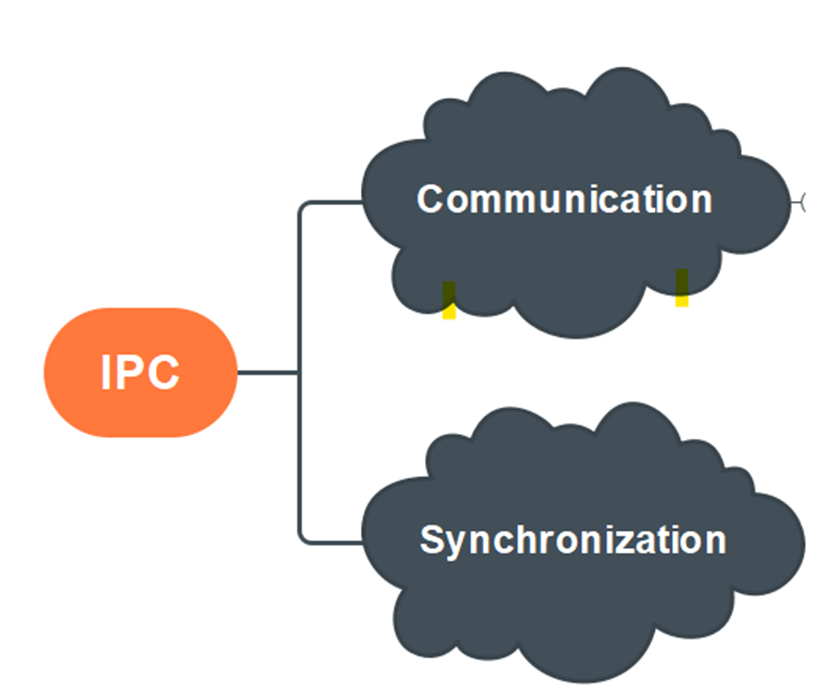
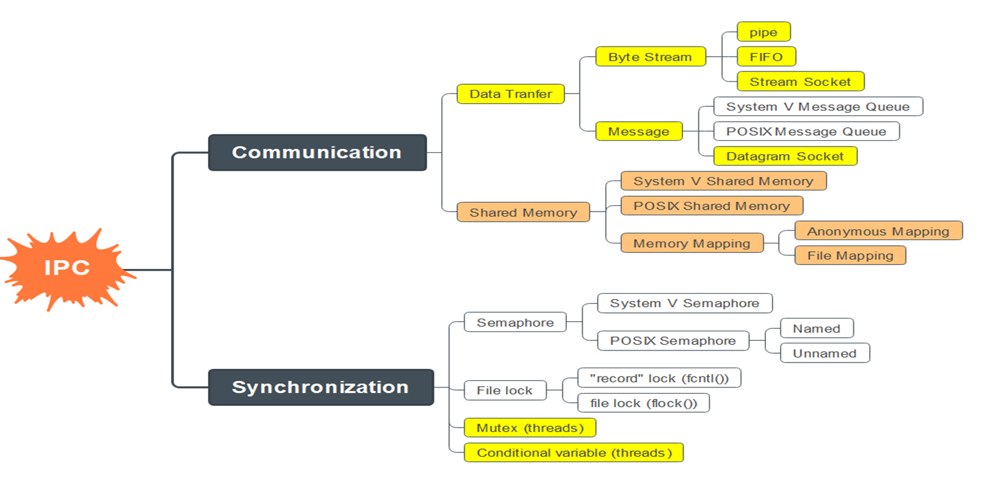
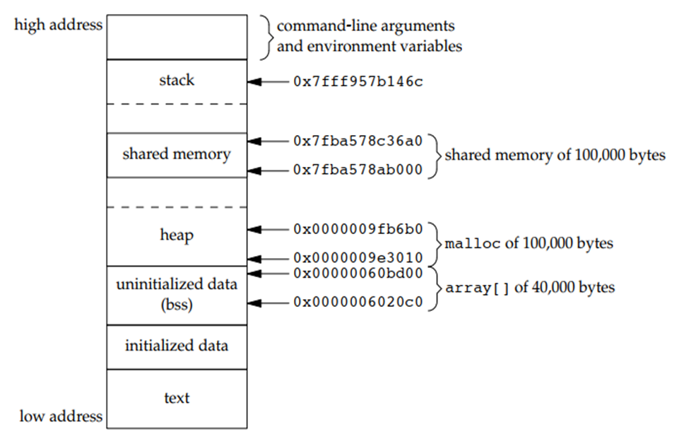

# Lesson 8 - IPC - Shared memory

## 1 - Introduction

IPC stands for Inter-Process Communication. It’s how separate processes (running programs) on a Linux system talk to each other—sharing data or coordinating actions.

Think of processes as workers in different rooms. IPC is like passing notes, shouting messages, or using a shared whiteboard to communicate—since they can’t just chat directly like threads in the same program.

Each process has its own memory space—unlike threads, which share memory. IPC bridges that gap.

Use Case: Your chat app uses threads now (same process), but if you switched to multiple processes (e.g., fork()), IPC would help them talk.

### Shared memory

Shared memory is a way for multiple processes in Linux to access the same chunk of memory—like a shared whiteboard or notepad they can all read from and write to.

Imagine two workers (processes) in separate offices. Normally, they can’t see each other’s notes because their desks (memory) are private. Shared memory is like putting a whiteboard in the hallway—they both scribble on it to share info.

Faster than other IPC methods (e.g., pipes or message queues)—no copying data back and forth; processes just read/write directly.

Direct Access: Like threads sharing memory, but for separate processes.

Concept:
- The OS creates a memory block.
- Processes “attach” it to their address space—like pinning the whiteboard to their wall.
- They read/write it—changes are instantly visible to all attached processes.

Two main approaches:
- System V Shared Memory: Older, uses shmget(), shmat(), shmdt().
- POSIX Shared Memory: Newer, uses shm_open(), mmap()—more file-like.

## 2 - POSIX memory

POSIX shared memory is a modern IPC (Inter-Process Communication) method in Linux that lets multiple processes share a memory region—like a shared sketchpad they can all draw on.

It’s newer and more flexible than System V shared memory (shmget), using a file-like interface with names (e.g., /my_shm) and memory mapping (mmap()).

Think of it as a named bulletin board in a hallway—processes “pin” it to their desk (memory space) and write/read notes.

- Step 1: Open a Shared Memory Object
    - What: Create or access a named shared memory object—like naming the bulletin board.
    - Function: shm_open()
        - Like open() for files—returns a file descriptor (fd).
        - Name starts with / (e.g., /chat_shm).
    - Args:
        - name: Unique name (e.g., /my_shm).
        - flags: O_CREAT | O_RDWR (create if new, read/write).
        - mode: Permissions (e.g., 0666—read/write for all).

- Step 2: Set the Size
    - What: Define how big the shared memory is—like sizing the bulletin board.
    - Function: ftruncate()
        - Sets the size of the memory object (in bytes).
    - Args:
        - fd: File descriptor from shm_open().
        - length: Size (e.g., 1024 bytes).

- Step 3: Map It to Memory
    - What: Attach the shared memory to the process’s address space—like pinning the board to your wall.
    - Function: mmap()
        - Maps the memory object into a pointer you can use.
    - Args:
        - addr: NULL (let OS pick address).
        - length: Same size as ftruncate().
        - prot: PROT_READ | PROT_WRITE (read/write access).
        - flags: MAP_SHARED (changes visible to all).
        - fd: From shm_open().
        - offset: 0 (start at beginning).

- Step 4: Use the Shared Memory
    - What: Read/write data using the pointer—like scribbling on the board.
    - How: Treat it like a regular variable—e.g., strcpy(ptr, "Hello").

- Step 5: Clean Up
    - What: Detach and remove the shared memory when done—like taking down the board.
    - Functions:
        - munmap(): Unmaps it from the process (detach).
        - close(): Closes the file descriptor.
        - shm_unlink(): Deletes the shared memory object (only one process needs to do this).

