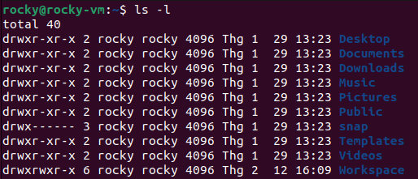
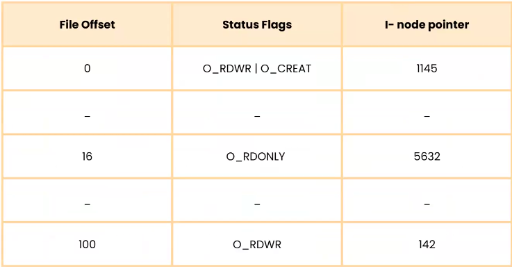
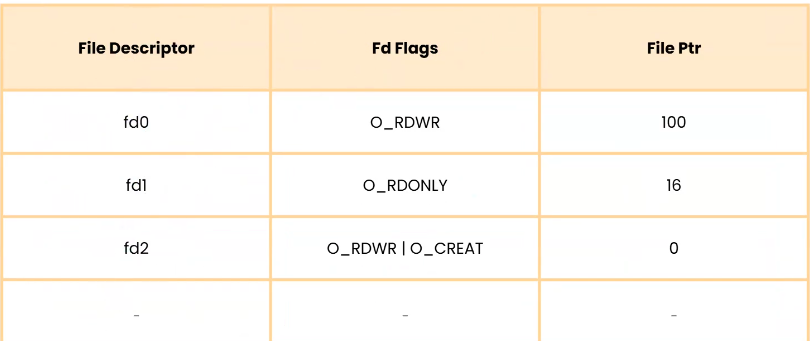
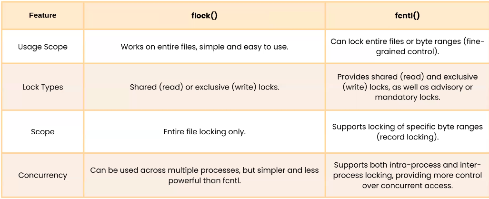

# Lession 2 - Linux file system

## 1 - Introduction
Everything in Linux is a file. This means that all system components (hardware & software) are represented as files in the file system. This simplifies interaction with devices, processes, and resources, making the system more flexible, modular, and easy to control.

Types of file on Linux
- Regular file: Normal file such as text file, executable file
- Directories file: File contains a list of other files.
- Character device file: File represents devices without memory address
- Block device file: File represents devices with memory address
- Link files: Represent another file
- Socket file: Represent for a Socket
- Pipe file: Represent for a Pipe

```
ls -l
```
This command lists all files and folders in the current folder.



- 1st column: File type, file permission
    - 1st char: File type (i.e: d (directory))
        - '-': Regular file	(-rw-r--r--)
        - d: Directory	(drwxr-xr-x)
        - l: Symbolic link	(lrwxrwxrwx)
        - b: Block device (e.g., disk)	(brw-r-----)
        - c: Character device (e.g., terminal)	(crw-rw----)
        - p: Named pipe (FIFO)	(prw-r--r--)
        - s: Socket (used for IPC)	srwxr-xr-x
    - 2-4 chars: Owner (user) permissions (i.e: rwx (read, write, execute))
    - 5-7 chars: Group permissions (i.e: r-x (read, execute))
    - 8-10 chars: Others (world) permissions (i.e: r-x (read, execute))
- 2nd column: Number of hardlink of file
- 3rd column: User name
- 4th column: Group name

In Linux, the root user is the superuser (administrator) with unrestricted access to the entire system. The root account has the highest level of privileges. Linux follows a strict permission model to protect the system. Regular users have limited access, but root can bypass all security restrictions. That’s why misusing root privileges can accidentally break the system.

Switch to user root using command:
```
sudo su
```

Check if you are root:
```
whoami
```

In Linux, file permissions determine **who** can read, write, or execute a file. You can modify these permissions using the `chmod` (change mode) command.

The symbolic mode (chmod) allows you to specify:
- User categories:
    - u → User (Owner)
    - g → Group
    - o → Others
    - a → All (User, Group, Others)
- Operations:
    - + → Add a permission
    - - → Remove a permission
    - = → Set exact permissions
- Permissions:
    - r → Read
    - w → Write
    - x → Execute

Example:
```
chmod u+x file.txt   # Give execute permission to user (owner)
chmod g-w file.txt   # Remove write permission from group
chmod o+r file.txt   # Add read permission for others
chmod a-x file.txt   # Remove execute permission from everyone
chmod u=rw,g=r,o= file.txt  # Set exact permissions (user: rw, group: r, others: none)
```

The numeric mode assigns a 3-digit octal value:
- 4 → Read (r)
- 2 → Write (w)
- 1 → Execute (x)
- 0 → No permission

|Octal Value|	Permission|	Binary|	Symbolic|
|-----------|-------------|-------|---------|
|0|	No permission|	000	|---|
|1|	Execute|	001	|--x|
|2|	Write|	010	|-w-|
|3|	Write + Execute|	011	|-wx|
|4|	Read|	100	|r--|
|5|	Read + Execute|	101	|r-x|
|6|	Read + Write|	110	|rw-|
|7|	Read + Write + Execute|	111	|rwx|

```
chmod 755 file.txt  # rwxr-xr-x  (Owner: rwx, Group: r-x, Others: r-x)
chmod 644 file.txt  # rw-r--r--  (Owner: rw-, Group: r--, Others: r--)
chmod 777 file.txt  # rwxrwxrwx  (Full permissions)
chmod 600 file.txt  # rw-------  (Only owner can read/write)
chmod 400 file.txt  # r--------  (Only owner can read)
```

The chown (change owner) command in Linux is used to change the owner and/or group of a file or directory.

```
chown [OPTIONS] NEW_OWNER[:NEW_GROUP] FILE
```
- NEW_OWNER → The new user who will own the file.
- NEW_GROUP (optional) → The new group for the file.
- FILE → The target file or directory.

Example:
- Changing File Owner
```
sudo chown alice myfile.txt
```
Changes the owner of myfile.txt to alice. Requires sudo (only root or the file owner can change ownership).

- Change File Group
```
sudo chown :managers myfile.txt
```
The `:` before the group name means only change the group. Now the group of `myfile.txt` is `managers`.

- Changing Both Owner and Group
```
sudo chown alice:managers myfile.txt
```
Sets alice as the new owner and sets managers as the new group.

- Changing Ownership for Multiple Files
```
sudo chown -R bob:staff /home/bob/documents
```
`-R` (recursive) → Applies changes to all files and subdirectories. Now bob owns all files inside /home/bob/documents.

## 2 - Read/Write to File

A system call (syscall) is a way for a user-space program (like a C program) to request a service from the Linux kernel.

Since user programs cannot directly access hardware (e.g., disk, memory, network), they use system calls to interact with the OS.

- User program makes a request (e.g., open(), read(), write()).
- The request switches from user mode → kernel mode.
- Kernel performs the requested operation (e.g., reading a file).
- The result is returned to the user program.

In Linux (and other operating systems), memory is divided into two spaces:
- User Space – Where user applications run.
- Kernel Space – Where the operating system (Linux kernel) runs.

User space is the part of system memory where regular programs (like ls, vim, gcc, etc.) run. It has restricted access to system resources (CPU, memory, files). If a program needs to access hardware or system resources, it must request it through system calls.

Kernel space is where the Linux kernel runs and manages:
-  Process scheduling (which program runs and when)
- Memory management (allocating RAM to processes)
- Device drivers (handling hardware like disks, network, etc.)
- File system management
- Network communication

Kernel provides some basic system call functions such as:
- open()
- read()
- write()
- lseek()
- close()

## 3 - File mangement
### Page cache
Page cache is a portion of RAM used by the Linux kernel to store frequently accessed data from disk. This helps speed up data retrieval, because accessing data from RAM is much faster than reading it from disk.

Process Requests File Data:
- A user process calls read() to read a file. 
- The kernel first looks in the page cache (RAM) to see if the requested file data is already stored in memory. 
    - If the data is found in page cache → it is returned immediately (fast).
    - If the data is not found in cache → a page fault occurs, and the kernel fetches the data from disk.
- If the requested data is not in cache, the kernel:
    - Reads the data from disk (slow).
    - Stores it in the page cache for future access (faster next time).
- The requested data is copied from the page cache (or disk) to the process’s memory space The process continues execution.
- The kernel does not immediately write data to disk when a process writes to a file. Instead, it:
    - Writes to the page cache (RAM).
    - Marks the page as "dirty" (modified but not yet written to disk).
    - Writes to disk later (based on system policies or explicit calls).

### I-Node table
In Linux (and other UNIX-like operating systems), an inode (Index Node) is a data structure used to store information about a file or a directory on the filesystem. The inode table is essentially a collection (or array) of all the inodes in a filesystem. Each file or directory on the system has an associated inode, and this inode contains metadata about the file or directory.

Inode Structure: An inode stores metadata about a file or directory, but not the actual data (content) of the file. The metadata typically includes:
- File Type: Whether it's a regular file, directory, symbolic link, etc.
- File Permissions: Read, write, and execute permissions for owner, group, and others.
- Owner: The user ID (UID) of the file's owner.
- Group: The group ID (GID) associated with the file.
- Size: The size of the file (in bytes).
- Timestamps:
    - Creation time (ctime)
    - Last modified time (mtime)
    - Last accessed time (atime)
- Link Count: Number of hard links pointing to the file.
- Pointers to Data Blocks: Addresses of the actual file content (blocks on disk where the data is stored).

The inode table is an internal structure in the filesystem that holds all inodes for the files and directories in that filesystem.
- It is created when the filesystem is created (formatted).
- The table contains a set number of inodes, and each inode corresponds to a file or directory.
- When you create a new file, the system allocates a free inode from the inode table to represent the new file.

Filesystems have a fixed number of inodes, which limits the maximum number of files and directories that can be created.


- When a new file is created, an inode is allocated from the inode table. The file's metadata (such as permissions, owner, and timestamps) is stored in the inode.
- When you access a file, the system looks up the file’s inode by searching through the inode table (using the directory entry to find the inode number). The inode provides information on how to retrieve the file data from the disk.
- **A directory is simply a special type of file that contains a list of filenames and their corresponding inode numbers. When you run a command like ls, the system reads the directory entries, looks up the corresponding inodes, and uses the inode information to display details about each file.**
- **When you delete a file, the system removes the corresponding directory entry and decrements the link count in the inode. If the link count reaches zero, the inode and the associated data blocks are released back to the filesystem.**

### Open file table
The open file table is a kernel-level data structure in Linux and other Unix-like operating systems that keeps track of all files currently opened by processes. It is part of the operating system's file management system and plays a crucial role in managing file access and sharing between processes.

The open file table maintains information about files that are currently opened by one or more processes. It ensures that multiple processes can access the same file efficiently and consistently.

Each entry in the open file table corresponds to a file that is currently opened. The entry contains metadata about the file's state, such as:
- The file's current read/write position (file offset).
- Access modes (e.g., read-only, write-only, read-write).
- Reference count (number of file descriptors pointing to this entry).

In short, when file is created, it's in I-Node table. When we open file, it will be in Open File Table.



### File descriptor table
The file descriptor table is a per-process data structure in Linux and other Unix-like operating systems that keeps track of the files and resources opened by that process. It is a critical part of the operating system's file management system and works in conjunction with the open file table and inode table to manage file access.



### Opening file process
- A process calls the open() system call to open a file, e.g.:
```c
int fd = open("myfile.txt", O_RDONLY);
```

- The kernel resolves the file path (myfile.txt) by traversing the directory structure. It locates the directory entry for myfile.txt, which contains the inode number of the file.

- The kernel uses the inode number to locate the corresponding entry in the inode table. The inode table contains metadata about the file, such as:
    - File type (regular file, directory, etc.)
    - Permissions
    - Ownership (UID, GID)
    - Size
    - Timestamps (access, modification, change times)
    - Pointers to the data blocks on disk where the file's contents are stored.

- The kernel creates an entry in the open file table for the opened file. This entry contains information about the file's state, such as:
    - File offset (current read/write position)
    - Access mode (read-only, write-only, read-write)
    - Reference count (number of file descriptors pointing to this entry).

- The kernel adds an entry to the process's file descriptor table. The entry maps a file descriptor (a small integer, e.g., 3) to the corresponding entry in the open file table. The file descriptor is returned to the process as the result of the open() system call.

- The process uses the file descriptor (fd) to perform operations on the file, such as read(), write(), or lseek(). Each operation uses the file descriptor to locate the entry in the file descriptor table, which points to the open file table entry, which in turn references the inode table entry.

- When the process calls close(fd), the kernel:
    - Removes the file descriptor from the process's file descriptor table.
    - Decrements the reference count in the open file table entry.
    - If the reference count reaches zero, the entry is removed from the open file table.

## 4 - File locking
File locking in Linux is a mechanism that allows processes to coordinate access to a file, ensuring that only one process (or a specific set of processes) can access a file or a portion of a file at a time. This is particularly useful in scenarios where multiple processes might try to read from or write to the same file simultaneously, which could lead to data corruption or inconsistencies.



Synchronization refers to the coordination of tasks or processes to ensure that they execute in a specific order or at specific times. It ensures that shared resources are accessed in a controlled manner to avoid conflicts, race conditions, or data corruption.

Asynchronization refers to the execution of tasks or processes independently, without waiting for each other to complete. Tasks can start, run, and complete in overlapping time periods, and their execution order is not strictly controlled.


|Aspect|	Synchronization	|Asynchronization|
|------|--------------------|---------------|
|Execution| Model	Blocking: Tasks wait for each other to complete.|	Non-Blocking: Tasks run independently without waiting.|
|Order of Execution|	Strictly controlled and sequential.|	Unordered or event-driven.|
|Resource Sharing|	Requires mechanisms like locks, semaphores, or barriers.|	No need for explicit coordination; tasks are independent.|
|Concurrency|	Limited by the need to wait for shared resources.|	High concurrency; tasks can overlap in time.|
|Use Cases|	Multi-threaded programming, shared data access.|	I/O-bound tasks, event-driven systems, responsive UIs.|
|Complexity|	Can lead to deadlocks, race conditions, or bottlenecks.|	Easier to scale but harder to debug due to non-linear flow.|
|Performance|	May reduce performance due to waiting.|	Improves performance and responsiveness.|

