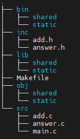

# Creating a shared and static library

<ins>**Step 1**</ins>: Prepare folder tree following the below image:



<ins>**Step 2**</ins>: In folder inc, add header files. In folder src, add source files and file main.c

File add.c
```c
#include <stdio.h>

int gSummand;

void setSummand(int summand) 
{
    gSummand = summand;
}

int add(int summand) 
{
    return gSummand + summand;
}
```

File answer.c
```c
#include "add.h"

int answer() 
{
    setSummand(20);
    return add(22);  // Will return 42 (=20+22)
}
```

File main.c
```c
#include <stdio.h>
#include "add.h"
#include "answer.h"

int main(int argc, char* argv[]) 
{
    setSummand(5);

    printf("5 + 7 = %d\n", add(7));
    printf("And the answer is: %d\n", answer());

  return 0;
}
```

File add.h
```c
#ifndef _ADD_H_
#define _ADD_H_

void setSummand(int summand);
int  add(int summand);

#endif
```

File answer.h
```c
#ifndef _ANSWER_H_
#define _ANSWER_H_

int answer();

#endif
```

<ins>**Step 3**</ins>: Prepare Makefile

```mk
CUR_DIR := .
SRC_DIR := $(CUR_DIR)/src
INC_DIR := $(CUR_DIR)/inc
BIN_SHARED_DIR := $(CUR_DIR)/bin/shared
BIN_STATIC_DIR := $(CUR_DIR)/bin/static
OBJ_DIR := $(CUR_DIR)/obj
OBJ_SHARED_DIR := $(CUR_DIR)/obj/shared
OBJ_STATIC_DIR := $(CUR_DIR)/obj/static
LIB_DIR := $(CUR_DIR)/lib
LIB_STATIC_DIR := $(LIB_DIR)/static
LIB_SHARED_DIR := $(LIB_DIR)/shared

C_FLAGS := -I $(INC_DIR)

create_objs:
    # create object files for shared lib
    gcc -c -fPIC $(SRC_DIR)/add.c    -o $(OBJ_SHARED_DIR)/add.o    $(C_FLAGS)
    gcc -c -fPIC $(SRC_DIR)/answer.c -o $(OBJ_SHARED_DIR)/answer.o $(C_FLAGS)
    # create object files for static lib
    gcc -c $(SRC_DIR)/add.c    -o $(OBJ_STATIC_DIR)/add.o    $(C_FLAGS)
    gcc -c $(SRC_DIR)/answer.c -o $(OBJ_STATIC_DIR)/answer.o $(C_FLAGS)
    # create object file for main
    gcc -c $(SRC_DIR)/main.c -o $(OBJ_DIR)/main.o $(C_FLAGS)

create_shared_lib:
    # create shared lib
    gcc -shared $(OBJ_SHARED_DIR)/add.o $(OBJ_SHARED_DIR)/answer.o -o $(LIB_SHARED_DIR)/libAddAnswerShared.so

create_static_lib:
    # create static lib
    ar rcs $(LIB_STATIC_DIR)/libAddAnswerStatic.a $(OBJ_STATIC_DIR)/add.o $(OBJ_STATIC_DIR)/answer.o

all: create_objs create_shared_lib create_static_lib
    # link share lib
    gcc $(OBJ_DIR)/main.o -L$(LIB_SHARED_DIR) -lAddAnswerShared -o $(BIN_SHARED_DIR)/use-shared-library
    # link static lib
    gcc $(OBJ_DIR)/main.o -L$(LIB_STATIC_DIR) -lAddAnswerStatic -o $(BIN_STATIC_DIR)/statically-linked

clean:
    rm -rf $(OBJ_DIR)/*.o
    rm -rf $(OBJ_SHARED_DIR)/*.o
    rm -rf $(OBJ_STATIC_DIR)/*.o
    rm -rf $(LIB_SHARED_DIR)/*.so
    rm -rf $(LIB_STATIC_DIR)/*.a
    rm -rf $(BIN_SHARED_DIR)/use-shared-library
    rm -rf $(BIN_STATIC_DIR)/statically-linked
```

- CUR_DIR: The current directory (. refers to the directory where the Makefile is located).
- SRC_DIR: Directory containing the source code files (e.g., add.c, answer.c, main.c).
- INC_DIR: Directory containing header files (e.g., add.h, answer.h).
- BIN_SHARED_DIR: Directory where the final executable using the shared library will be placed.
- BIN_STATIC_DIR: Directory where the final executable using the static library will be placed.
- OBJ_DIR: Directory for object files (intermediate files generated during compilation).
- OBJ_SHARED_DIR: Directory for object files used to build the shared library.
- OBJ_STATIC_DIR: Directory for object files used to build the static library.
- LIB_DIR: Directory where the libraries (static and shared) will be stored.
- LIB_STATIC_DIR: Directory for the static library (libAddAnswerStatic.a).
- LIB_SHARED_DIR: Directory for the shared library (libAddAnswerShared.so).

- C_FLAGS: Compiler flags. Here, -I $(INC_DIR) tells the compiler to look for header files in the INC_DIR directory.
- Target create_objs: This target compiles the source files (add.c, answer.c, main.c) into object files (.o).
Shared Library Objects:  
-fPIC: Generates position-independent code, which is required for shared libraries.  
Object files are placed in OBJ_SHARED_DIR.  
Static Library Objects:  
Object files are placed in OBJ_STATIC_DIR.  
Main Program Object:  
The main.c file is compiled into an object file and placed in OBJ_DIR.  
- Target create_shared_lib: This target creates a shared library (libAddAnswerShared.so) from the object files (add.o and answer.o).  
-shared: Tells the compiler to create a shared library.  
The library is placed in LIB_SHARED_DIR.  

- Target create_static_lib: This target creates a static library (libAddAnswerStatic.a) from the object files (add.o and answer.o).  
ar rcs: The ar command is used to create static libraries. rcs stands for:  
r: Replace existing files in the archive.  
c: Create the archive if it doesn’t exist.  
s: Write an index into the archive.  
The library is placed in LIB_STATIC_DIR.  

- Target all: This is the default target (run when you type make).  
It depends on create_objs, create_shared_lib, and create_static_lib, so those targets are executed first.  

- Shared Library Linking:  
Links main.o with the shared library (libAddAnswerShared.so).  
-L$(LIB_SHARED_DIR): Tells the linker where to find the shared library.  
-lAddAnswerShared: Links the shared library (the lib prefix and .so suffix are omitted).  
The resulting executable is placed in BIN_SHARED_DIR.  

- Static Library Linking:  
Links main.o with the static library (libAddAnswerStatic.a).  
-L$(LIB_STATIC_DIR): Tells the linker where to find the static library.  
-lAddAnswerStatic: Links the static library (the lib prefix and .a suffix are omitted).  
The resulting executable is placed in BIN_STATIC_DIR.  

- Target clear: This target cleans up the project by removing all generated files (object files, libraries, and executables). Useful for starting fresh or freeing up space.
