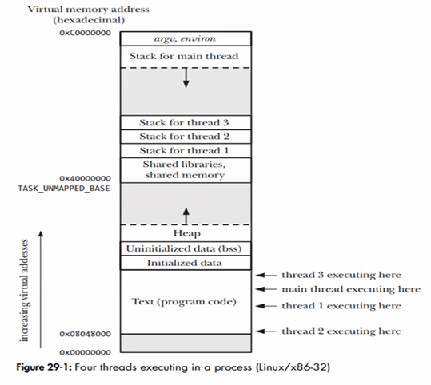
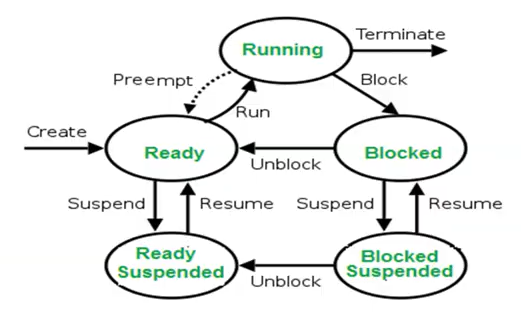
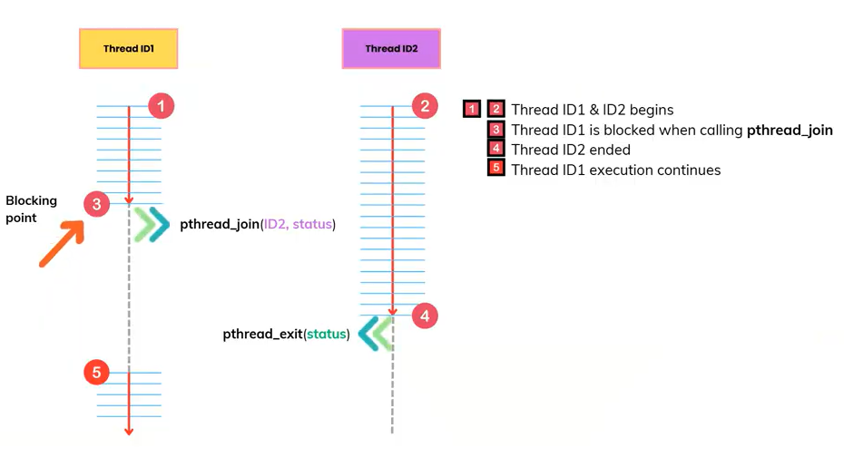

# Lesson 4 - Thread

## 1- Introduction

A process is a program that is executing and using system resources. (A process is like a complete cooking project happening in the kitchen. It’s a program that’s running—like “making a cake.”)

Each process has its own space (like its own counter, oven, and ingredients). It doesn’t share these with other processes unless told to. For example, if you’re running a web browser and a music player at the same time, those are two separate processes. The browser doesn’t mess with the music player’s stuff.

- It’s independent: One process crashing (like burning the cake) doesn’t ruin another process (the soup still cooks fine).
- It has its own memory and resources, managed by the operating system (the kitchen boss).

*Real-world analogy: Imagine two chefs in the kitchen, each working on their own dish with their own tools. They don’t bump into each other unless they choose to share something.*

A thread is a lightweight process that can be managed independently by a scheduler. (A thread is like a single step or worker inside one of those cooking projects (a process). It’s a smaller piece of work that shares the same space and resources as the process it belongs to.)

Threads live inside a process. So, in our “making a cake” process, one thread might be mixing the batter, while another thread is preheating the oven.

They share the same memory and tools (like the same mixing bowl and oven), which makes them faster and lighter than starting a whole new process.

Example: In a web browser (a process), one thread might load a webpage while another thread plays a video on that page.

- Threads are faster to create and switch between because they don’t need their own separate space.
- But if one thread messes up (like spilling batter everywhere), it can mess up the whole process (the cake is ruined).

*Real-world analogy: One chef with two hands—one hand is stirring, the other is pouring. They’re part of the same job and share the same counter.*

Similar to processes, threads are created for the purpose of processing multiple tasks at the same time (multi-task)

A process always has a main process that is `main()` function.

In the Linux kernel, every thread is treated as a “task” with its own unique ID (called a TID, or thread ID). The scheduler manages these tasks individually, not the process as a group.

Example: A process might have three threads—Thread A (mixing batter), Thread B (preheating the oven), and Thread C (setting the table). The scheduler sees them as three separate tasks on its list.

The scheduler keeps a run queue (its to-do list) of all tasks ready to use the CPU. This includes threads from all processes. So, Thread A from Process 1 might be next to Thread X from Process 2 on the list.

Switching between threads in the same process is faster than switching between processes:
- They share memory, so the scheduler doesn’t need to swap out the whole “kitchen counter” (memory space)—it just changes which “hand” (thread) is working.
- It saves the current thread’s state (like where it is in the recipe) and loads the next thread’s state.

Since threads share the process’s resources (memory, files, etc.), the scheduler doesn’t separate them out—it just runs them as individual tasks. This makes thread scheduling lightweight but means they need to cooperate (or they’ll trip over each other).

### Thread Executing

On a multi-core syste, multiple threads can work in parallel.

In the same process, if one thread is blocked, the other threads will still work normally. A thread is “blocked” when it’s waiting for something—like input, a timer, or a resource (e.g., a mutex lock). It’s not crashed; it’s just paused. n Linux, the scheduler treats each thread as a separate task. If one thread is blocked, the scheduler skips it and gives CPU time to other ready threads in the same process (or others). Blocking only stops that thread’s work—it doesn’t inherently mess up the shared memory or resources, so the process keeps going.

In the same process, if one thread crashes badly enough, it often takes down the entire process—including all its threads.All threads in a process share the same memory and resources (like one chef’s counter in the kitchen). If one thread messes up that shared space, it affects everyone. A “crash” here means something serious—like a segmentation fault (accessing memory it shouldn’t), divide-by-zero, or another fatal error. When a thread crashes, the operating system (Linux kernel) detects the error. It doesn’t just stop that one thread—it terminates the whole process because the shared resources might now be corrupt or unstable. This sends a signal (like SIGSEGV for a segfault) to the process, and unless the program catches it (which is rare), the process—and all its threads—dies.

Every time a thread is created, they are placed in stack segments.



### Context Switching

When a process is removed from access to the processor, sufficient information on its current operating state must be stored. Because when it is again scheduled to run on the processor it can resume its operation from an identical position.

This operational state date is known as its context. The context of a process includes its address space, stack space, virtual address space, register set image (e.g. Program Counter (PC), Stack Pointer (SP)).

The act of removing the process of execution from the processor (and replacing it with another) is known as a process switch or context switch.



A context switch is when the operating system (like Embedded Linux) pauses one task (a process or thread) that’s using the CPU and switches to another task. It’s how the system juggles multiple jobs on a single CPU, making it look like they’re running at the same time—even though only one can cook at once.

How context switch work:

- Step 1: Trigger the Switch
    - Something tells the scheduler it’s time to switch tasks.
    - This could be because:
        - The current task’s time is up (e.g., it’s run for 10 milliseconds).
        - The task is waiting for something (like sensor data) and can’t continue.
        - A more important task (higher priority) is ready.
    
Example: Thread 1 has been checking a temperature sensor for 10ms, and its time slice ends.

- Step 2: Pause the Current Task
    - The scheduler stops the current task from running.
    - The CPU gets an interrupt (a signal) from a timer or event, giving control to the scheduler.
    - The task is paused mid-work; the CPU stops executing its instructions.

Example: Thread 1 is paused while calculating the temperature.

- Step 3: Save the Current Task’s Context

    - The scheduler saves everything the CPU was doing for the current task so it can resume later.
    - All the details needed to restart, including:
        - Program Counter: Where in the code it was (e.g., “line 42”).
        - Registers: Temporary data in the CPU (e.g., numbers it was using).
        - Stack Pointer: Where its memory “scratchpad” was pointing.
    - This info is copied from the CPU into a memory area for that task.

Example: Thread 1’s state (e.g., “at line 42, register A = 72°F”) is saved.

- Step 4: Choose the Next Task
    - The scheduler picks the next task to run.
    - It checks its list (the run queue) of tasks that are ready.
    - Decision:
        - For normal tasks, it picks the one that’s waited longest (fairness, using the Completely Fair Scheduler).
        - For real-time tasks, it picks the highest-priority one.

Example: Thread 2, which updates the display, hasn’t run recently, so it’s chosen.

- Step 5: Load the New Task’s Context
    - The scheduler loads the saved details of the new task into the CPU.
    - Tt takes the new task’s context (saved earlier) and puts it into the CPU’s registers, program counter, etc.
    - This restores the new task to where it left off last time.

Example: Thread 2’s state (e.g., “at line 15, register B = pixel 50”) is loaded.

- Step 6: Start the New Task
    - The CPU begins running the new task.
    -  With the context loaded, the CPU jumps to the new task’s next instruction and starts executing.
    - The old task waits in memory; the new task takes over.

Example: Thread 2 starts updating the display for its 10ms time slice.

- Step 7: Repeat
    - This process loops—after Thread 2’s turn, the scheduler might switch back to Thread 1 or another task, saving and loading contexts each time.

Round Robin (RR), Time Sharing, and Shortest Job First (SJF) scheduling methods are ways a scheduler (the part of the operating system that decides which task runs on the CPU) manages multiple tasks.

Round Robin is a scheduling method where every task gets a turn to use the CPU for a fixed amount of time, one after another, in a circle. It’s like everyone gets a fair shot, no matter how long their work takes.

- Each task gets a time slice (e.g., 10 milliseconds) to run.
- The scheduler lines up all the tasks and lets them take turns in order.
- If a task isn’t done when its time is up, it goes to the back of the line and waits for its next turn.
- If a task finishes early, it leaves, and the next one steps up.

Example:
- Scenario: Three students (tasks) want to use the computer:
    - Student A: Needs 20ms to finish homework.
    - Student B: Needs 10ms to check email.
    - Student C: Needs 30ms to write a report.

Time Slice: 10ms per turn.

- Steps:
    - A runs for 10ms (10ms left), then stops.
    - B runs for 10ms (done, leaves).
    - C runs for 10ms (20ms left), then stops.
    - A runs for 10ms (done, leaves).
    - C runs for 10ms (10ms left), then stops.
    - C runs for 10ms (done, leaves).

Total Time: 60ms, but everyone got equal turns.

Time Sharing is a general idea where the CPU is split between multiple tasks so they all seem to run at once. It’s not a specific method but a goal—Round Robin is one way to do it.

- The scheduler quickly switches between tasks, giving each a small bit of time (like a few milliseconds).
- By swapping fast, it tricks you into thinking all tasks are running together, even on one CPU.
- It’s about making the system feel responsive for everyone using it.

Example
- Scenario: Same three students:
    - A (20ms), B (10ms), C (30ms).
- Time Sharing with RR (10ms slices, like above):
    - The teacher switches the computer between them every 10ms.
    - A gets 10ms, then B, then C, and repeats.
    - It feels like they’re all working at once, even thoughonly one uses the computer at a time.

Result: After 60ms, all finish, and no one waits too long to start.

Shortest Job First picks the task that will take the least time to finish and runs it first. It’s like letting the student with the quickest task cut the line.

- The scheduler looks at all waiting tasks and guesses how long each will take (needs to know this ahead of time).
- It runs the shortest one first, then the next shortest, and so on.
- If a new short task arrives, it might jump ahead of longer ones (in some versions, called “preemptive SJF”).

Scenario: Same three students:
- A: 20ms.
- B: 10ms (shortest).
- C: 30ms.

- Steps:
    - B runs for 10ms (done, shortest first).
    - A runs for 20ms (done, next shortest).
    - C runs for 30ms (done, longest last).

- Total Time: 60ms, but average wait time is lower:
    - B waits 0ms, A waits 10ms, C waits 30ms → Average = (0 + 10 + 30) / 3 = 13.3ms.

## 2 - Conpare between Process & Thread

### Context switching time
- Processes take longer because they use more resources
- Threads need less time because they are lighter than processes

### Shared memory
- When creating a process with fork(), the process and child process reside in 2 different allocated memory areas. Sharing data between them becomes more difficult
- Sharing data between threads in a process is faster and easier ecause they reside in the memory address saoace of process.
- Sharing data between processes is more diffcult. Through the IPC mechanism.
- Threas in a process can share data with each other quickly and easier.

Shared memory is a way for different parts of a program (threads or processes) to use the same chunk of memory to share information. It’s like a shared notepad where multiple people can read or write stuff to work together.

Threads are like teammates working inside the same “room” (a process). Because they’re part of the same process, they automatically share all the memory of that process—like having one big whiteboard everyone can see and use.

When a process starts, it gets a block of memory (its “address space”) for things like variables, data, and code.

All threads in that process use this same memory. If one thread writes something (like a number or a message), the others can read or change it instantly—no extra setup needed.

Processes are like separate workers in different “rooms.” Each process has its own private memory (its own whiteboard), and they don’t share it by default—the operating system keeps them isolated for safety.

To share memory, processes have to set it up using special tools provided by the system (like `shmget` or `mmap` in Linux).

This creates a specific chunk of memory that both processes can access—like putting a shared whiteboard in the hallway between their rooms.

They connect to this shared area, and then they can read or write to it, but their private memory stays separate.

### Crashed

If one process fails, other processes still execute normally.

If one thread fails, other threads in the same process terminate immediately.

## 3 - Operations on Thread
### Thread ID

A thread in a process is identified by a Thread ID.

- Process IDs are unique throughout the system, where Thread IDs are unique within a process
- A Process ID is an integer value but a Thread ID is a structure
- Process ID can be obtained very easily while Thread ID cannot

In C, using the pthread library, thread IDs are of type `pthread_t`. Here’s how to compare them:

Step 1: Get the Thread IDs
    - You can get a thread’s ID in two ways:
        - When Creating a Thread: The `pthread_create()` function gives you the TID of the new thread.
        - Inside a Thread: The `pthread_self()` function tells a thread its own TID.

Step 2: Compare Them
    - Use the `pthread_equal()` function to compare two `pthread_t` values. This is the safe and portable way because `pthread_t` might not just be a simple number—it could be a structure or something else depending on the system.

Why Not ==?
    - You shouldn’t directly use == (e.g., tid1 == tid2) because:
        - `pthread_t` isn’t guaranteed to be a plain integer—it might be complex (like a struct).
        - `pthread_equal()` handles the comparison correctly no matter how `pthread_t` is implemented.

```c
#include <stdio.h>
#include <pthread.h>
#include <unistd.h> // For sleep()

// Function that each thread runs
void* thread_function(void* arg) {
    pthread_t my_tid = pthread_self(); // Get my own thread ID
    pthread_t main_tid = *(pthread_t*)arg; // Get the main thread's ID (passed as argument)

    // Compare my TID with the main thread's TID
    if (pthread_equal(my_tid, main_tid)) {
        printf("I’m the main thread!\n");
    } else {
        printf("I’m a different thread, TID: %lu\n", (unsigned long)my_tid);
    }
    return NULL;
}

int main() {
    pthread_t main_tid = pthread_self(); // Main thread’s ID
    pthread_t thread1_tid, thread2_tid;  // IDs for new threads

    // Create two threads, passing the main thread's ID
    pthread_create(&thread1_tid, NULL, thread_function, &main_tid);
    pthread_create(&thread2_tid, NULL, thread_function, &main_tid);

    // Compare thread1_tid and thread2_tid
    if (pthread_equal(thread1_tid, thread2_tid)) {
        printf("Thread 1 and Thread 2 are the same (impossible here)!\n");
    } else {
        printf("Thread 1 and Thread 2 are different.\n");
    }

    // Run the main thread’s function too
    thread_function(&main_tid);

    // Wait for threads to finish
    pthread_join(thread1_tid, NULL);
    pthread_join(thread2_tid, NULL);

    return 0;
}
```

Output
```
Thread 1 and Thread 2 are different.
I’m the main thread!
I’m a different thread, TID: 123456789
I’m a different thread, TID: 987654321
```

### Create Thread
To create a new thread, we use `pthread_create()` function.

Every process has at least one thread. The thread containing the main function is called the main thread.

Return 0 if succeed, else, return a number bigger than 0

```c
int pthread_create(pthread_t threadID, const pthread_atr_t *attr, void *(*start)(void *), void *arg)
```

### Terminate Thread

- Thread ends normally (when thread finishes its execution)
- Thread terminates when calling `pthread_exit()` function from that thread
- Thread is canceled when calling `pthread_cancel()` function from another thread
- Any thread that calls the exit() function (when it returns), or the main thread terminates, all remaining threads terminate immediately.

### Example

```c
#include <stdio.h>
#include <stdlib.h>
#include <string.h>
#include <unistd.h>
#include <pthread.h>

pthread_t thread_id1, thread_id2;

typedef struct {
    char name[30];
    char msg[30];
} thr_data_t;

static void *thr_handle(void *args) 
{
    pthread_t tid = pthread_self();
    thr_data_t *data = (thr_data_t *)args;

    if (pthread_equal(tid, thread_id1)) {
        printf("I'm thread_id1\n\n");
    } else {
        printf("I'm thread_id2\n");
        printf("Hello %s, welcome to join %s\n", data->name, data->msg);
    }
}

static void *thr_handle2(void *args)
{
	printf("Hi im thread handle2\n");
}

int main(int argc, char const *argv[])
{
    /* code */
    int ret;
    thr_data_t data = {0};

    strncpy(data.name, "phonglt9", sizeof(data.name));                 
    strncpy(data.msg, "KMA thread programming\n", sizeof(data.msg));

    if (ret = pthread_create(&thread_id1, NULL, &thr_handle, NULL)) {
        printf("pthread_create() error number=%d\n", ret);
        return -1;
    }

    sleep(2);

    if (ret = pthread_create(&thread_id2, NULL, &thr_handle, &data)) {
        printf("pthread_create() error number=%d\n", ret);
        return -1;
    }

    sleep(5);

    return 0;
}
```

## 4 - Thread Management
### Thread Joining

Thread joining is when one thread waits for another thread to finish its work before moving on. It’s like telling a teammate, “I’ll wait here until you’re done, then we’ll continue together.”

In C, you use the `pthread_join()` function to make this happen. It’s about one thread (usually the main one) waiting for another thread to finish and then cleaning up after it.

Why use thread joining?
- Synchronization: You might need to wait for a thread to complete its task before the program does something else—like waiting for a calculation to finish before showing the result.
- Clean Exit: If the main thread (the one that starts in main()) exits before other threads finish, the whole program stops, and those threads might get cut off. Joining ensures everything wraps up properly.
- Get Results: You can grab a value a thread returns when it finishes (like a final answer it computed).



When you call `pthread_join()`:
- The calling thread (e.g., the main thread) pauses and waits.
- It waits until the target thread (the one you’re joining) finishes its job and exits.
- Once the target thread is done, the calling thread wakes up and keeps going.

```c
#include <stdio.h>
#include <pthread.h>

// Function the thread runs
void* thread_function(void* arg) {
    printf("Thread starting... I’ll work for 2 seconds.\n");
    sleep(2); // Pretend to work for 2 seconds
    printf("Thread finished!\n");
    return NULL; // Could return a value here
}

int main() {
    pthread_t my_thread; // Variable to hold the thread’s ID

    // Create a thread
    if (pthread_create(&my_thread, NULL, thread_function, NULL) != 0) {
        printf("Error creating thread!\n");
        return 1;
    }

    printf("Main thread: Waiting for my thread to finish...\n");

    // Wait for the thread to finish
    if (pthread_join(my_thread, NULL) != 0) {
        printf("Error joining thread!\n");
        return 1;
    }

    printf("Main thread: The thread is done, I can move on now!\n");

    return 0;
}
```

Output
```
Main thread: Waiting for my thread to finish...
Thread starting... I’ll work for 2 seconds.
[2-second pause]
Thread finished!
Main thread: The thread is done, I can move on now!
```

A thread zombie is a thread that has finished its work (it’s “dead”) but hasn’t been cleaned up yet because no one has “picked up its body.” It’s stuck in a limbo state, taking up a little space until another thread comes along to handle it.

Without cleanup, these zombie threads pile up in the process’s memory, taking up space (not a lot, but it adds up if you make tons of threads).

In technical terms: It’s a thread that has terminated (exited) but its resources (like its thread ID and exit status) are still hanging around in the system because it hasn’t been **joined**.

This happens with pthreads when:
    - A thread finishes its job (e.g., returns from its function or calls `pthread_exit()`).
    - No other thread calls `pthread_join()` on it to collect its exit status and free its resources.

Normally, `pthread_join()` “reaps” the thread—clears its remains and lets the system reuse its ID. Without joining, it lingers as a zombie.

When a thread finishes (e.g., returns from its function or calls `pthread_exit()`), it doesn’t just vanish completely. Here’s why:
- Resources Stay Behind: Even after a thread stops running, the system keeps some info about it—like its thread ID (TID) and its exit status (a value it might return, like “I computed 42”). This info sits in memory, managed by the process it belongs to.
- The system holds onto this so another thread (like the main one) can check what happened—did it succeed? What did it return? It’s like leaving a note saying, “I’m done, here’s my result.”
- If no one picks up that note (the exit status) and says, “Okay, we’re good,” that info stays in memory, and the thread becomes a zombie—finished but not fully gone.

When you call `pthread_join(thread_id, NULL)`, the calling thread (e.g., main) pauses until the thread with thread_id finishes. This ensures you don’t move on too soon—like waiting for a teammate to finish their part of a project.

Once that thread finishes, `pthread_join()` tells the system, “This thread’s done—free its resources.” It picks up the “note” (exit status), clears the thread’s ID, and removes it from the process’s list of threads. No zombie left behind.

|Action|	Threads|	Processes|
|------|-------------|-----------|
|Ending|	pthread_exit() or return|	exit()|
|What Ends Does|	Stops thread, leaves zombie|	Stops process, leaves zombie|
|Cleaning|	pthread_join()|	wait()|
|What Clean Does	|Waits, frees thread resources|	Waits, frees process entry|
|Zombie	|Thread ID/status in process	|PID/status in process table|

#### pthread_join()

```c
int pthread_join(pthread_t thread, void **retval);
```

`pthread_join()` will block until a thread terminates. If therad exit, `pthread_join` returns immediately.

When the thread ends, it will be treated similarly to a zombie process. If the number of zombie thread is getting bigger and bigger, at some point, we won't be able to create more thread. The role of pthread_join() is similar to waitpid()

Arguments:
- thread: threadID of a specific thread
- **retval: if retval is not NULL, it will get the return value of pthread_exit(). Returns 0 on success, less than 0 on failure.

### Thread Detaching

Thread detaching is when you tell a thread, “Go do your job, and when you’re done, clean yourself up—I won’t wait for you.” It’s like sending a worker off on a task and saying, “Don’t report back—just disappear when you’re finished.”

You don’t need another thread (like the main one) to wait for it to finish with `pthread_join()`. It’s perfect for “fire-and-forget” tasks where you don’t care when or how it ends.

A detached thread automatically cleans up its resources (like its thread ID and exit status) when it finishes—no thread zombie lingers, unlike a joined thread that needs `pthread_join()` for cleanup.

If you’re creating lots of threads and don’t need their results or timing, detaching keeps things tidy without extra code.

```c
#include <stdio.h>
#include <pthread.h>
#include <unistd.h> // For sleep()

// Thread function
void* thread_function(void* arg) {
    printf("Thread: Starting... I’ll work for 2 seconds.\n");
    sleep(2); // Simulate work
    printf("Thread: Done!\n");
    return NULL; // Exit status ignored since it’s detached
}

int main() {
    pthread_t my_thread;

    // Create a thread
    if (pthread_create(&my_thread, NULL, thread_function, NULL) != 0) {
        printf("Error creating thread!\n");
        return 1;
    }

    // Detach the thread
    if (pthread_detach(my_thread) != 0) {
        printf("Error detaching thread!\n");
        return 1;
    }

    printf("Main: Thread is detached, I won’t wait for it.\n");
    sleep(3); // Wait a bit to see the thread finish, then exit
    printf("Main: Exiting.\n");
    return 0;
}
```

|Aspect|	Joining (pthread_join())	|Detaching (pthread_detach())|
|------|-------------------------------|---------------------|
|Waiting|	Yes—waits for thread to finish|	No—main keeps going|
|Cleanup|	Manual—pthread_join()| cleans it	Automatic—thread cleans itself|
|Zombie|	Yes, if not joined|	No zombies ever|
|Return Value|	Can collect it (e.g., retval)	|Ignored—no way to get it|
|Use Case|	Need result or timing control|	Fire-and-forget tasks|

```c
#include <stdio.h>
#include <stdlib.h>
#include <string.h>
#include <unistd.h>
#include <pthread.h>

pthread_t thread_id1, thread_id2, thread_id3;

typedef struct {
    char name[30];
    char msg[30];
} thr_data_t;

static void *thr_handle1(void *args)
{
    thr_data_t *thr = (thr_data_t *)args;
    sleep(1);
    printf("hello %s !\n", thr->name);
    printf("thread1 handler\n");

    pthread_exit(NULL); // exit

}

static void *thr_handle2(void *args)
{
    sleep(5);
    //pthread_exit(NULL); // exit
    //exit(1);
    while (1) {
     	printf("thread2 handler\n"); 
   	    sleep(1);
    };
}

static void *thr_handle3(void *args)
{
    pthread_detach(pthread_self());
    //sleep(2);
    //pthread_exit(NULL);
}

int main(int argc, char const *argv[])
{
    /* code */
    int ret, counter = 0;
    int retval;
    thr_data_t data = {0};

    strncpy(data.name, "phonglt9", sizeof(data.name));                 
    strncpy(data.msg, "Posix thread programming\n", sizeof(data.msg));

    if (ret = pthread_create(&thread_id1, NULL, &thr_handle1, &data)) {
        printf("pthread_create() error number=%d\n", ret);
        return -1;
    }

    if (ret = pthread_create(&thread_id2, NULL, &thr_handle2, NULL)) {
        printf("pthread_create() error number=%d\n", ret);
        return -1;
    }
    
    //sleep(5);
    //pthread_cancel(thread_id2);
    //pthread_join(thread_id2, NULL);
    //printf("thread_id2 termination\n"); 
    while (1) {
	    if (ret = pthread_create(&thread_id3, NULL, &thr_handle3, NULL)) {
        	printf("pthread_create() error number=%d\n", ret);
        	break;
    	}
	    counter++;
  	    //pthread_join(thread_id3, NULL);

        if (counter%1000 == 0) {
            printf("Thread created: %d\n", counter);
        }
    }   

    return 0;
}
```

`pthread_cancel() `is a function that lets you tell a thread, “Stop what you’re doing and end now.” It’s like calling a worker over the radio and saying, “Drop everything and clock out.”

It’s a way to forcefully terminate a thread from outside, instead of waiting for it to finish naturally (e.g., by returning or calling `pthread_exit()`).

You might need to kill a thread that’s stuck, taking too long, or no longer needed—like shutting down a task when a program is closing.

It’s useful when a thread is in a loop or waiting forever, and you can’t rely on it to stop on its own.

Gives you a way to manage threads that don’t have a built-in “stop” signal.

It sends a cancellation request to the target thread.

The thread doesn’t stop instantly—it stops at specific points (called cancellation points) where it checks for this request.

If the thread reaches a cancellation point and the request is active, it exits cleanly, running any cleanup handlers you’ve set up (if any).

## 5 - Thread synchronization

**Atomic** means something happens all at once, as a single, unbreakable step—like flipping a light switch. It either fully happens or doesn’t happen at all; there’s no “halfway” state.

In programming, an atomic operation is one that can’t be interrupted or split up by other threads or processes.

When multiple threads or processes are running, they might try to change the same thing (like a variable) at the same time. Atomic operations ensure no one steps on anyone else’s toes—it’s done in one clean move.

**Non-atomic** means an operation can be interrupted or split into smaller steps—like pouring water into a glass slowly. Another thread can jump in before it’s done, causing confusion.

Most regular operations (e.g., x = x + 1) are non-atomic unless you make them atomic.

Non-atomic operations can lead to race conditions—where the outcome depends on who runs first, and things get messed up if threads overlap.

A **critical section** is a piece of code that accesses or changes a shared resource (like a variable or file) and needs to run without interruption—like a “do not disturb” zone.

Only one thread (or process) should be in a critical section at a time to avoid conflicts.

If two threads enter a critical section at once, they might overwrite each other’s changes or read half-updated data (a race condition). Protecting it ensures safety.

A **shared resource** is anything (like a variable, file, or memory) that multiple threads or processes can use—like a whiteboard everyone can write on.

In threads, shared resources are automatic (they share the process’s memory). In processes, you set them up (e.g., shared memory).

Sharing is powerful—threads can work together—but dangerous if not controlled. Unprotected access leads to conflicts (race conditions).

|Term|	Definition|	Why It Matters|	Example|
|----|------------|--------------|---------|
|Atomic	|Single, uninterruptible step|	Prevents race conditions|	atomic_add(&x, 1)|
|Non-Atomic|	Can be interrupted, multi-step|	Risks conflicts without protection	|x = x + 1|
|Critical Section|	Code needing exclusive access|	Protects shared resources|	Locked count++|
|Shared Resources|	Data used by multiple threads/processes|	Enables teamwork, needs safety|Variable balance|

## 6 - Thread Sync-Mutex Lock

**Mutex** stands for mutual exclusion. It’s like a lock on a door that only one person (thread) can hold at a time. If you have the lock, you can go in; if not, you wait until it’s free.

In programming, a mutex is a tool to make sure only one thread can run a specific piece of code (a critical section) or access a shared resource at a time, preventing conflicts.

When multiple threads share something—like a variable or file—they might step on each other’s toes. For example, two threads adding to a counter at the same time could mess it up (a race condition).

A mutex ensures only one thread gets access at a time, keeping things safe and orderly—like making sure only one person writes on a shared whiteboard.

- Locking: A thread “locks” the mutex before touching the shared resource or running the critical section. If it’s already locked, the thread waits.
- Unlocking: When the thread is done, it “unlocks” the mutex, letting another thread take over.
- One at a Time: Only one thread holds the lock—others queue up until it’s their turn.

Key Functions (in `pthreads`)
- `pthread_mutex_init(pthread_mutex_t *mutex, const pthread_mutexattr_t *attr)`: Sets up a mutex (creates the lock).
- `pthread_mutex_lock(pthread_mutex_t *mutex)`: Locks the mutex (grabs the key).
- `pthread_mutex_unlock(pthread_mutex_t *mutex)`: Unlocks it (releases the key).
- `pthread_mutex_destroy(pthread_mutex_t *mutex)`: Cleans up the mutex when you’re done.

```c
#include <stdio.h>
#include <pthread.h>

// Shared resource
int counter = 0;

// Mutex to protect the counter
pthread_mutex_t mutex;

void* increment_counter(void* arg) {
    for (int i = 0; i < 1000; i++) {
        pthread_mutex_lock(&mutex);   // Lock the mutex
        counter++;                    // Critical section: increment counter
        pthread_mutex_unlock(&mutex); // Unlock the mutex
    }
    return NULL;
}

int main() {
    pthread_t thread1, thread2;

    // Initialize the mutex
    pthread_mutex_init(&mutex, NULL);

    // Create two threads
    pthread_create(&thread1, NULL, increment_counter, NULL);
    pthread_create(&thread2, NULL, increment_counter, NULL);

    // Wait for threads to finish
    pthread_join(thread1, NULL);
    pthread_join(thread2, NULL);

    // Clean up the mutex
    pthread_mutex_destroy(&mutex);

    printf("Final counter value: %d\n", counter);
    return 0;
}
```

Example 2:

```c
#include <stdio.h>
#include <stdlib.h>
#include <string.h>
#include <unistd.h>
#include <pthread.h>

pthread_mutex_t lock1 = PTHREAD_MUTEX_INITIALIZER;
pthread_mutex_t lock2 = PTHREAD_MUTEX_INITIALIZER;
int counter = 2; // shared variable/shared resources/global variable

typedef struct {
    char name[30];
    char msg[30];
} thread_args_t;

static void *handle_th1(void *args) 
{   

    thread_args_t *thr = (thread_args_t *)args;
    //sleep(1);

    pthread_mutex_lock(&lock1);
    // critical section 
    printf("hello %s !\n", thr->name);
    printf("thread1 handler, counter: %d\n", ++counter);
    sleep(5);

    pthread_mutex_unlock(&lock1);

    pthread_exit(NULL); // exit

}

static void *handle_th2(void *args) 
{
    pthread_mutex_lock(&lock1);
    printf("thread2 handler, counter: %d\n", ++counter);
    pthread_mutex_unlock(&lock1);

    pthread_exit(NULL); // exit
}

int main(int argc, char const *argv[])
{
    /* code */
    int ret;
    thread_args_t thr;
    pthread_t thread_id1, thread_id2;

    memset(&thr, 0x0, sizeof(thread_args_t));
    strncpy(thr.name, "phonglt9", sizeof(thr.name));

    if (ret = pthread_create(&thread_id1, NULL, &handle_th1, &thr)) {
        printf("pthread_create() error number=%d\n", ret);
        return -1;
    }

    if (ret = pthread_create(&thread_id2, NULL, &handle_th2, NULL)) {
        printf("pthread_create() error number=%d\n", ret);
        return -1;
    }
    
    // used to block for the end of a thread and release
    pthread_join(thread_id1,NULL);  
    pthread_join(thread_id2,NULL);

    return 0;
}
```

## 7 - Thread Sync- Conditional Variable

A condition variable is like a waiting room with a bell. It lets threads wait until something they need happens—like waiting for a delivery before starting work—and then wake up when it’s ready.

In programming, it’s a tool to make threads pause (wait) until a specific condition is true (e.g., “data is ready”) and get notified when that condition changes.

Synchronization: Threads often need to coordinate:
    - One thread might produce something (e.g., data).
    - Another thread waits to use it.
    You don’t want the waiting thread to keep checking (“Is it ready yet?”)—that wastes CPU. - A condition variable lets it sleep until signaled.

Efficiency: Instead of busy-waiting (looping and checking), threads wait passively and wake up only when needed.

A condition variable works with a mutex (a lock) to manage shared resources safely. Here’s the basic flow:
- Wait: A thread locks the mutex, checks a condition (e.g., “Is the data here?”). If false, it waits on the condition variable, unlocking the mutex while it sleeps.
- Signal: Another thread changes the condition (e.g., “Data is here!”), locks the mutex, and rings the bell (signals the condition variable) to wake the waiting thread.
- Wake Up: The waiting thread wakes up, re-locks the mutex, and proceeds.

Key Functions (in `pthreads`)
- `pthread_cond_init(pthread_cond_t *cond, const pthread_condattr_t *attr)`: Sets up the condition variable.
- `pthread_cond_wait(pthread_cond_t *cond, pthread_mutex_t *mutex)`: Waits for a signal, unlocking the mutex while waiting.
- `pthread_cond_signal(pthread_cond_t *cond)`: Wakes up one waiting thread.
- `pthread_cond_broadcast(pthread_cond_t *cond)`: Wakes up all waiting threads.
- `pthread_cond_destroy(pthread_cond_t *cond)`: Cleans up the condition variable.

Example 1:

```c
#include <stdio.h>
#include <pthread.h>
#include <unistd.h>

// Shared resource
int data = 0;
int data_ready = 0; // Condition flag

// Mutex and condition variable
pthread_mutex_t mutex = PTHREAD_MUTEX_INITIALIZER;
pthread_cond_t cond = PTHREAD_COND_INITIALIZER;

void* producer(void* arg) {
    sleep(2); // Simulate work
    pthread_mutex_lock(&mutex); // Lock to update shared data
    data = 42;                  // Produce data
    data_ready = 1;             // Set condition true
    printf("Producer: Data is ready (%d)\n", data);
    pthread_cond_signal(&cond); // Signal waiting thread
    pthread_mutex_unlock(&mutex);
    return NULL;
}

void* consumer(void* arg) {
    pthread_mutex_lock(&mutex); // Lock to check condition
    while (!data_ready) {       // Wait if data isn’t ready
        printf("Consumer: Waiting for data...\n");
        pthread_cond_wait(&cond, &mutex); // Wait and unlock mutex
    }
    printf("Consumer: Got data (%d)\n", data);
    pthread_mutex_unlock(&mutex);
    return NULL;
}

int main() {
    pthread_t prod, cons;

    pthread_create(&prod, NULL, producer, NULL);
    pthread_create(&cons, NULL, consumer, NULL);

    pthread_join(prod, NULL);
    pthread_join(cons, NULL);

    return 0;
}
```

Output:

```
Consumer: Waiting for data...
[2-second pause]
Producer: Data is ready (42)
Consumer: Got data (42)
```

Example 2:

```c
#include <stdio.h>
#include <stdlib.h>
#include <string.h>
#include <unistd.h>
#include <pthread.h>

#define THRESHOLD   5

pthread_mutex_t lock = PTHREAD_MUTEX_INITIALIZER;
pthread_cond_t cond = PTHREAD_COND_INITIALIZER;
int counter; // critical section <=> global resource

typedef struct {
    char name[30];
    char msg[30];
} thread_args_t;

static void *handle_th1(void *args) 
{
    thread_args_t *thr = (thread_args_t *)args;

    pthread_mutex_lock(&lock);
    printf("Hello %s !\n", thr->name);

    while (counter <= THRESHOLD) {
        counter += 1;
        printf("Counter = %d\n", counter);
        sleep(1);
    }

    pthread_cond_signal(&cond);
    printf("thread1 handler, counter = %d\n", counter);
    pthread_mutex_unlock(&lock);

    pthread_exit(NULL); // exit or return;

}

int main(int argc, char const *argv[])
{
    /* code */
    int ret;
    thread_args_t thr;
    pthread_t thread_id1, thread_id2;

    memset(&thr, 0x0, sizeof(thread_args_t));
    strncpy(thr.name, "phonglt9", sizeof(thr.name));

    if (ret = pthread_create(&thread_id1, NULL, &handle_th1, &thr)) {
        printf("pthread_create() error number=%d\n", ret);
        return -1;
    }

    pthread_mutex_lock(&lock);
    while (1) {
        // ready in advance when pthread_cond_signal() is called
        pthread_cond_wait(&cond, &lock);
        if(counter == THRESHOLD) {
           printf("Global variable counter = %d.\n", counter);
           break;
        }
    }
    pthread_mutex_unlock(&lock);
    
    // used to block for the end of a thread and release
    pthread_join(thread_id1,NULL); 

    return 0;
}
```
