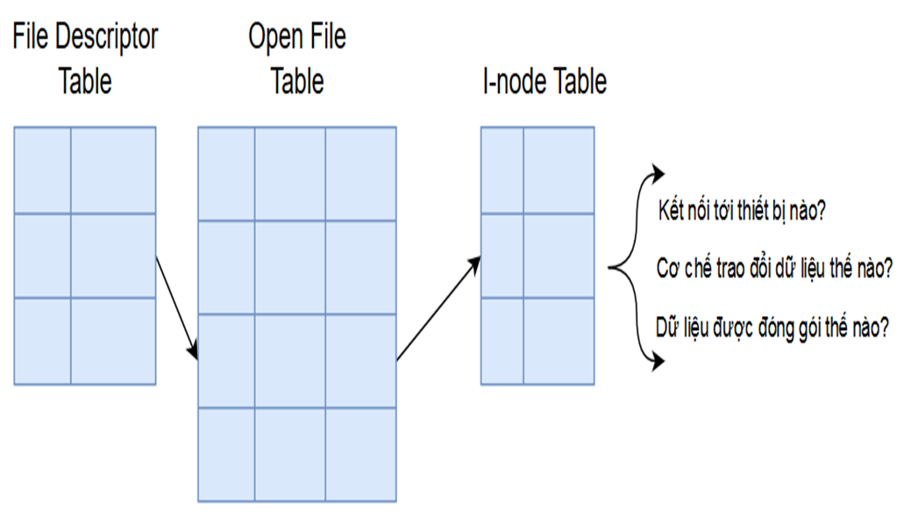
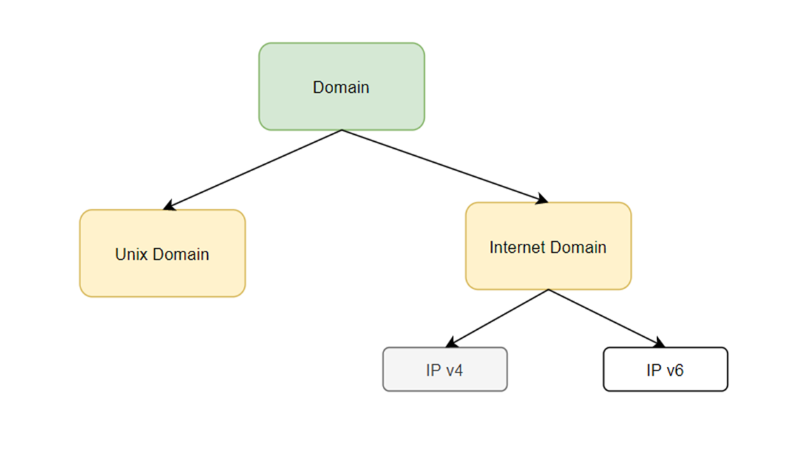
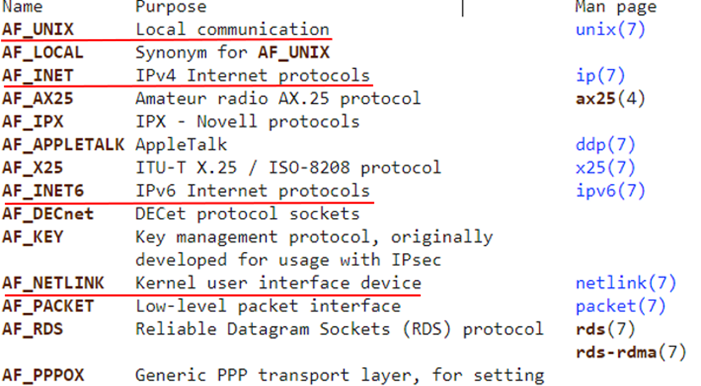
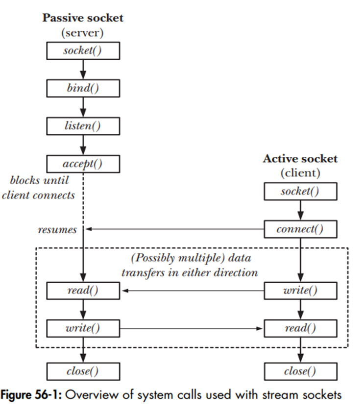
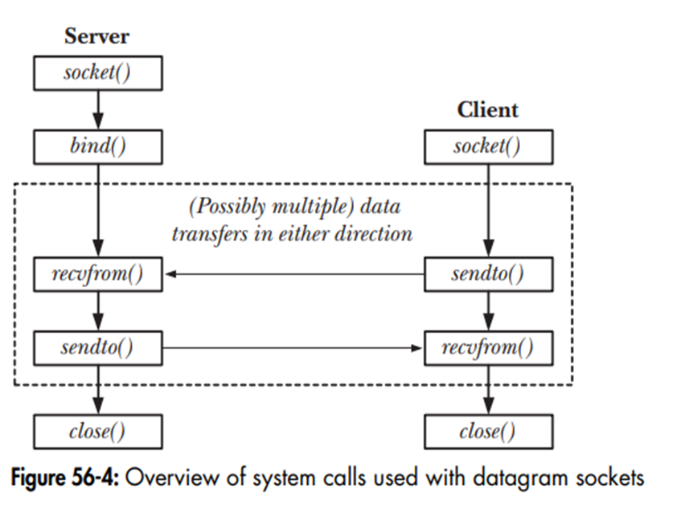

# Lesson 6 - Socket

## 1 - Introduction

A socket is like a telephone in Unix—it’s a way for two programs (or processes) to talk to each other, either on the same computer or across different computers (e.g., over the internet).

Think of a socket as a plug you stick into a wall outlet—once plugged in, electricity (data) can flow between devices.

It’s an endpoint for communication—sending and receiving messages—like a mailbox where you drop letters or pick them up.

Socket is represented by a file socket descriptor. Information described in a file socket includes: Domain, Type and Protocol. The socket is just the tool—we need to decide where it works (domain), how it sends messages (type), and what rules it uses (protocol). It’s like picking the phone’s network, call style, and language before dialing.

A socket is created with a function called `socket()`—it gives you a number (called a file descriptor, like `server_fd`) to identify this “phone line.”

Example: `server_fd = socket(AF_INET, SOCK_STREAM, 0)`—this sets up a socket for chatting over the internet.



### Domain



The domain is the “place” or “area” where your socket works—like choosing whether your phone call stays in your house or goes across the city.

Programs need to know if they’re chatting locally (same computer) or far away (internet)—the domain sets the location. Think of your house as one computer. If your friend is in your house, you use a walkie-talkie (local). If they’re across town, you use a cell phone (internet). The domain picks the “neighborhood.”

Common domains:
- AF_INET: For talking over the internet—like calling someone in another country. Uses IP addresses (like 192.168.1.1).
    - Example: `server_fd = socket(AF_INET, SOCK_STREAM, 0);`
    - `AF_INET` means “use the internet”—the server can chat with a client on another machine.
- AF_UNIX (or AF_LOCAL): For talking on the same computer—like two apps chatting locally. Uses file paths (like “/tmp/mysocket”).
    - Example: `socket(AF_UNIX, SOCK_STREAM, 0)`

When creating a socket, you pick a domain with socket(domain, type, protocol).

`AF_INET` for network stuff (e.g., web), `AF_UNIX` for same-machine stuff (e.g., two apps chatting locally).

### Type

The type is the “style” of talking—how messages travel through the socket. It’s like choosing how you send a message: a long, careful phone call or quick, short notes.

Different chats need different styles—some need every word perfect, others just need speed.

#### Stream socket (TCP)

Messages flow like a steady stream of water—continuous, reliable, in order.

Protocol: Uses TCP (Transmission Control Protocol).

Like a phone call—everything you say arrives in the right order, no missing words.

- Guarantees delivery—no data lost.
- Keeps order—words don’t get jumbled.
- Two-way—both sides can talk.

Use: Web browsing (HTTP), email—where accuracy matters.

`socket(AF_INET, SOCK_STREAM, 0)`—0 means TCP by default.

#### Datagram socket (UDP)

Messages are sent like separate packets (datagrams)—quick, no guarantees.

Protocol: Uses UDP (User Datagram Protocol).

Like sending postcards—each one’s independent, might arrive out of order or get lost.

- Fast—no waiting for confirmations.
- No order guarantee—packets might shuffle.
- Might lose data—no retries.

Use: Video streaming, gaming—where speed beats perfect delivery.

Pick `SOCK_STREAM` or `SOCK_DGRAM` in `socket()`—defines the communication style.

### Protocol



The protocol is like the “language” or “rules” the socket uses to talk—it’s how the data gets packaged and delivered.

It’s the etiquette of your telephone call—do you speak politely with handshakes (TCP) or just yell short bursts (UDP)?

- TCP (Transmission Control Protocol):
    - Pairs With: Stream sockets (`SOCK_STREAM`).
    - Rules:
        - Checks that all data arrives (re-sends if lost).
        - Keeps data in order.
        - Sets up a connection first (handshake).
    - Analogy: Like mailing a package with tracking—ensures it gets there.
- UDP (User Datagram Protocol):
    - Pairs With: Datagram sockets (`SOCK_DGRAM`).
    - Rules:
        - Sends data fast, no checking.
        - No connection—just fires packets.
        - No order or delivery guarantee.
    - Analogy: Like throwing paper airplanes—some might miss the target.

How It Works:

Specified in `socket(domain, type, protocol)`—e.g., socket(`AF_INET`, `SOCK_STREAM`, `IPPROTO_TCP`) for TCP.

Often 0 (default)—Unix picks TCP for stream, UDP for datagram.

Example:

- Stream Socket with TCP (Internet)

    - Scenario: Parent sends “Hi” to child over the internet.
    - Setup: `socket(AF_INET, SOCK_STREAM, 0)`—TCP implied.
    - Flow:
        - Parent binds to an IP/port, listens.
        - Child connects—TCP handshake ensures reliable link.
        - Parent sends “Hi”—child gets it, guaranteed.

- Datagram Socket with UDP (Local)
    - Scenario: Parent blasts “Hi” to child on same machine.
    - Setup: `socket(AF_UNIX, SOCK_DGRAM, 0)`—UDP implied.
    - Flow:
        - Parent sends “Hi” to a file path (e.g., “/tmp/socket”).
        - Child reads—might get it, might not, no fuss.

|Concept|	Stream Socket (TCP)|	Datagram Socket (UDP)|
|-------|----------------------|-------------------------|
|Type|	SOCK_STREAM|	SOCK_DGRAM|
|Protocol|	TCP|	UDP|
|Delivery|	Guaranteed, ordered|	Not guaranteed, unordered|
|Speed	|Slower (checks everything)|	Faster (no checks)|
|Use	|Web, files	|Video, games|

## 2 - Flow
### IPv4 Stream socket



server

```c
#include <stdio.h>
#include <stdlib.h>
#include <string.h>
#include <errno.h>
#include <sys/socket.h>     //  Chứa cấu trúc cần thiết cho socket. 
#include <netinet/in.h>     //  Thư viện chứa các hằng số, cấu trúc khi sử dụng địa chỉ trên internet
#include <arpa/inet.h>
#include <unistd.h>

#define LISTEN_BACKLOG 50
#define BUFF_SIZE 256
#define handle_error(msg) \
    do { perror(msg); exit(EXIT_FAILURE); } while (0)


/* Chức năng chat */
void chat_func(int new_socket_fd)
{       
    int numb_read, numb_write;
    char sendbuff[BUFF_SIZE];
    char recvbuff[BUFF_SIZE];
    
    while (1) {        
        memset(sendbuff, '0', BUFF_SIZE);
        memset(recvbuff, '0', BUFF_SIZE);

        /* Đọc dữ liệu từ socket */
        /* Hàm read sẽ block cho đến khi đọc được dữ liệu */
        numb_read = read(new_socket_fd, recvbuff, BUFF_SIZE);
        if(numb_read == -1)
            handle_error("read()");
        if (strncmp("exit", recvbuff, 4) == 0) {
            system("clear");
            break;
        }
        printf("\nMessage from Client: %s\n", recvbuff);

        /* Nhập phản hồi từ bàn phím */
        printf("Please respond the message : ");
        fgets(sendbuff, BUFF_SIZE, stdin);

        /* Ghi dữ liệu tới client thông qua hàm write */
        numb_write = write(new_socket_fd, sendbuff, sizeof(sendbuff));
        if (numb_write == -1)
            handle_error("write()");
        
        if (strncmp("exit", sendbuff, 4) == 0) {
            system("clear");
            break;
        }

        sleep(1);
    }
    close(new_socket_fd);
}

int main(int argc, char *argv[])
{
    int port_no, len, opt;
    int server_fd, new_socket_fd;
    struct sockaddr_in serv_addr, client_addr;

    /* Đọc portnumber trên command line */
    if (argc < 2) {
        printf("No port provided\ncommand: ./server <port number>\n");
        exit(EXIT_FAILURE);
    } else
        port_no = atoi(argv[1]);

    memset(&serv_addr, 0, sizeof(struct sockaddr_in));
    memset(&client_addr, 0, sizeof(struct sockaddr_in));
    
    /* Tạo socket */
    server_fd = socket(AF_INET, SOCK_STREAM, 0);
    if (server_fd == -1)
        handle_error("socket()");
    // fprintf(stderr, "ERROR on socket() : %s\n", strerror(errno));

    /* Ngăn lỗi : “address already in use” */
    if (setsockopt(server_fd, SOL_SOCKET, SO_REUSEADDR | SO_REUSEPORT, &opt, sizeof(opt)))
        handle_error("setsockopt()");  

    /* Khởi tạo địa chỉ cho server */
    serv_addr.sin_family = AF_INET;
    serv_addr.sin_port = htons(port_no);
    serv_addr.sin_addr.s_addr =  INADDR_ANY; //inet_addr("192.168.5.128"); //INADDR_ANY

    /* Gắn socket với địa chỉ server */
    if (bind(server_fd, (struct sockaddr*)&serv_addr, sizeof(serv_addr)) == -1)
        handle_error("bind()");

    /* Nghe tối đa 5 kết nối trong hàng đợi */
    if (listen(server_fd, LISTEN_BACKLOG) == -1)
        handle_error("listen()");

    /* Dùng để lấy thông tin client */
    len = sizeof(client_addr);

    while (1) {
        printf("Server is listening at port : %d \n....\n",port_no);
        new_socket_fd  = accept(server_fd, (struct sockaddr*)&client_addr, (socklen_t *)&len); 
        if (new_socket_fd == -1)
            handle_error("accept()");

        system("clear");
        
        //char temp[BUFF_SIZE];
        //inet_ntop(client_addr.sin_family, (struct sockaddr*)&client_addr, temp, sizeof(temp));
        printf("Server : got connection \n");
                chat_func(new_socket_fd);
    }
    close(server_fd);
    return 0;
}
```

client
```c
#include <stdio.h>
#include <stdlib.h>
#include <string.h>
#include <errno.h>
#include <sys/socket.h>     //  Chứa cấu trúc cần thiết cho socket. 
#include <netinet/in.h>     //  Thư viện chứa các hằng số, cấu trúc khi sử dụng địa chỉ trên internet
#include <arpa/inet.h>
#include <unistd.h>

#define BUFF_SIZE 256
#define handle_error(msg) \
    do { perror(msg); exit(EXIT_FAILURE); } while (0)
        
/* Chức năng chat */
void chat_func(int server_fd)
{
    int numb_write, numb_read;
    char recvbuff[BUFF_SIZE];
    char sendbuff[BUFF_SIZE];
    while (1) {
        memset(sendbuff, '0', BUFF_SIZE);
                         memset(recvbuff, '0', BUFF_SIZE);
        printf("Please enter the message : ");
        fgets(sendbuff, BUFF_SIZE, stdin);

        /* Gửi thông điệp tới server bằng hàm write */
        numb_write = write(server_fd, sendbuff, sizeof(sendbuff));
        if (numb_write == -1)     
            handle_error("write()");
        if (strncmp("exit", sendbuff, 4) == 0) {
            printf("Client exit ...\n");
            break;
        }
        
        /* Nhận thông điệp từ server bằng hàm read */
        numb_read = read(server_fd, recvbuff, sizeof(recvbuff));
        if (numb_read < 0) 
            handle_error("read()");
        if (strncmp("exit", recvbuff, 4) == 0) {
            printf("Server exit ...\n");
            break;
        }

        printf("\nMessage from Server: %s\n",recvbuff);   
    }
    close(server_fd); /*close*/ 
}

int main(int argc, char *argv[])
{
    int portno;
    int server_fd;
    struct sockaddr_in serv_addr;
    memset(&serv_addr, '0',sizeof(serv_addr));
    
    /* Đọc portnumber từ command line */
    if (argc < 3) {
        printf("command : ./client <server address> <port number>\n");
        exit(1);
    }
    portno = atoi(argv[2]);
    
    /* Khởi tạo địa chỉ server */
    serv_addr.sin_family = AF_INET;
    serv_addr.sin_port   = htons(portno);
    if (inet_pton(AF_INET, argv[1], &serv_addr.sin_addr) == -1) 
        handle_error("inet_pton()");
    
    /* Tạo socket */
    server_fd = socket(AF_INET, SOCK_STREAM, 0);
    if (server_fd == -1)
        handle_error("socket()");
    
    /* Kết nối tới server*/
    if (connect(server_fd, (struct sockaddr *)&serv_addr, sizeof(serv_addr)) == -1)
        handle_error("connect()");
    
    chat_func(server_fd);

    return 0;
}
```

Server:
- `socket(AF_INET, SOCK_STREAM, 0)`: Creates a TCP socket in the internet domain.
- `bind()`: Ties it to an IP (e.g., INADDR_ANY = any local IP) and port (e.g., 12345).
- `listen()`: Waits for clients (up to 50 in queue).
- `accept()`: Connects to a client—starts chat.
- `chat_func()`: Reads/writes messages—reliable thanks to TCP.

Client:
- `socket(AF_INET, SOCK_STREAM, 0)`: Same TCP socket.
- `connect()`: Dials server’s IP and port (e.g., 192.168.1.100:12345).
- `chat_func()`: Sends/receives messages—ordered delivery.

### IPv4 Datagram socket



## 3 - Internet Domain Socket

The number 0x1234 (hexadecimal):
- Big endian: Stored as 12 34 (bytes).
- Little endian: Stored as 34 12.


```
which ls
```

We get where `ls` locates

```
file [ls location]
```

We will know our machine is big edian or little edian.

Network byte order is big edian

If you send a number (e.g., 1234) from a little-endian machine to a big-endian one without adjusting, it might read as 3412—wrong! Functions like `htons()` (host-to-network short) convert your number to “network byte order” (big-endian) before sending, and `ntohs()` converts back—ensures everyone agrees.

A: htons(port)
B: ntohs(port)

A->Network (Big Edian)
htons(port): host to net short

Network (Big Edian) -> B
ntohs(port): net to host short

Why sending a string, we don't care about big edian or little edian? 

Strings are just bytes of characters, not numbers with a value to interpret. A string like “Hi” is stored as bytes: H (0x48), i (0x69), \0 (0x00). Each byte is sent as is—no flipping or reordering needed. Bytes in a string aren’t combined into a single number (like 0x1234)—they’re individual letters. Sender and receiver read them left-to-right, byte-by-byte—no endian confusion.

Strings are bytes (“H,” “i”), sent one-by-one—no multi-byte number to flip. Numbers (like ports) need htons() because endianness changes their order.

OSI model ?

The OSI (Open Systems Interconnection) model is like a recipe book with 7 steps (layers) for how computers talk to each other over a network—breaking the process into chunks.

BTVN

Unix Datagram Socket
Unix Stream Socket
IPv4 Datagram Socket
IPv4 Stream Socket

