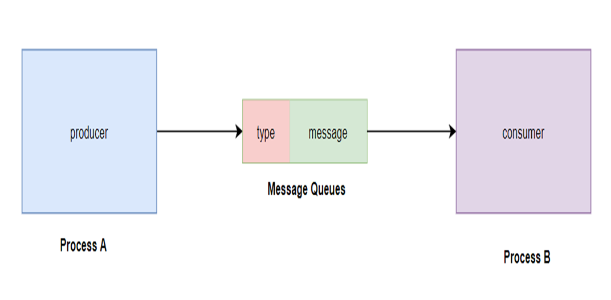
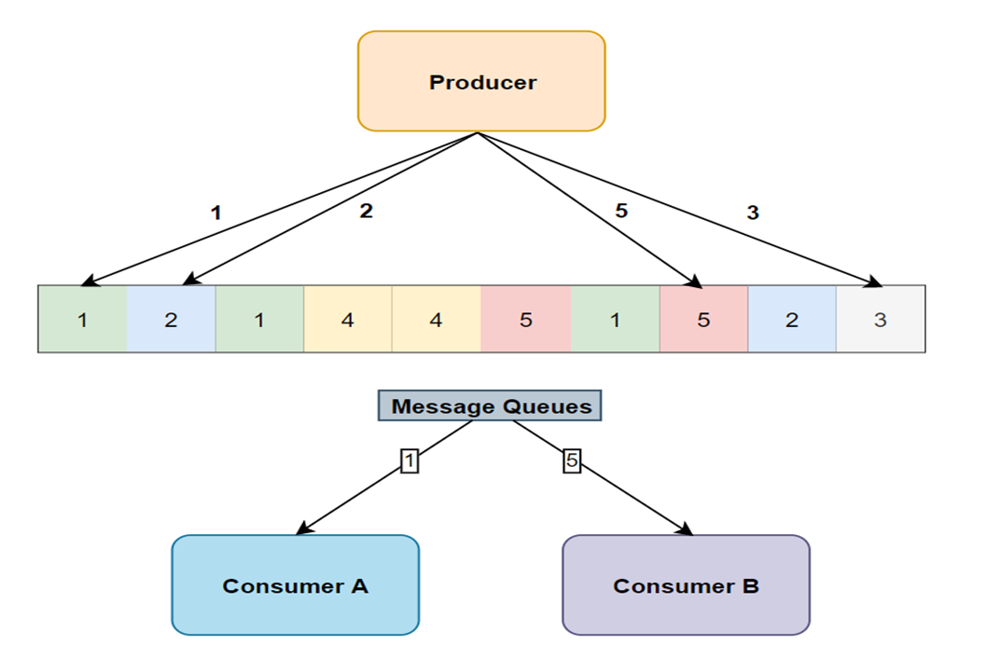

# Lesson 9 - IPC - Message Queues

## 1 - Introduction

Sometimes programs (or processes) run separately—like one’s a server, another’s a client—and they can’t just yell across the room. They need a way to send messages even if the other isn’t listening right now.

Message queues is like a mailbox system for programs. One program drops a message into the mailbox, and another picks it up later. It’s organized, reliable, and lets programs talk without needing to be online at the exact same time.



Message queues are stored in the kernel—Linux’s core memory, not your program’s space. This makes them shared across processes and persistent until explicitly removed.



Each queue is like a list managed by the kernel:
- Messages: Little packets with a type (like a label) and data (the content).
- Order: Usually stored in FIFO (first-in, first-out) order, but you can grab messages by type

Every message has:
- long `mtype`: A number (e.g., 1, 2) to categorize it—like “urgent” or “chat message.”
- Data: A chunk of bytes (e.g., “Hi from Alice!”)—size depends on your struct, up to a system limit (often 8KB).

Example:
```c
struct msgbuf {
    long mtype;      // Type (e.g., 1 for "chat")
    char mtext[100]; // Data (e.g., "Hi!")
};
```

Kernel stores this as one message: [mtype: 1, mtext: "Hi!"].

Storage Details:
- Queue: A linked list in kernel memory—each message points to the next.
- Limits: System-wide caps (e.g., MSGMNI for max queues, MSGMAX for max message size—check /proc/sys/kernel/msg*).
- Persistence: Stays alive even if processes exit, until deleted with msgctl(..., IPC_RMID, ...).

## 2 - System V Message Queues

Linux gives us a toolbox called System V IPC (an older but solid set of tools) to create and use message queues. Here’s the basic flow:
- Create a Queue: Set up the mailbox with a unique address (key).
- Send Messages: Drop notes into the mailbox.
- Receive Messages: Pick up notes from the mailbox.
- Clean Up: Remove the mailbox when done.

`ftok()` - Make a Unique Key
- What It Does: Creates a special number (key) to identify your mailbox so different programs can find it.
- Simple Terms: Like picking a mailbox number (e.g., “Box 42”) based on a file and a code.
- Example:
```c
key_t key = ftok("/tmp", 'A');
```
- Uses “/tmp” (a file path) and ‘A’ (a letter) to make a unique key.

`msgget()` - Get or Create the Queue
- What It Does: Opens the mailbox with your key. If it doesn’t exist, it makes one.
- Simple Terms: “Give me Box 42, or build it if it’s not there.”
- Example:
```c
int msqid = msgget(key, IPC_CREAT | 0666);
```
- `msqid`: Mailbox ID (like “Box 42”).
- `IPC_CREAT`: Make it if it’s not there.
- `0666`: Permissions (read/write for everyone).

`msgsnd()` - Send a Message
- What It Does: Puts a note in the mailbox.
- Simple Terms: “Drop this note in Box 42.”

`msgrcv()` - Receive a Message
- What It Does: Picks up a note from the mailbox.
- Simple Terms: “Check Box 42 for any notes.”

`msgctl()` - Control the Queue (e.g., Delete)
- What It Does: Manages the mailbox, like removing it when you’re done.
- Simple Terms: “Throw away Box 42.”

Queue Limits:
- Max Messages: `MSGQNUM` (e.g., 16K messages per queue).
- Max Bytes: `MSGMNB` (e.g., 16KB total data in queue).
- If full, `msgsnd()` blocks (waits) unless you say “don’t wait” (`IPC_NOWAIT`).

- No Auto-Cleanup: Unlike pipes, queues stick around until `msgctl(..., IPC_RMID, ...)`—manual cleanup needed.
- Access Control: Permissions (e.g., `0666`) decide who can send/receive—like file permissions.

Run `ipcs -q` to see active queues:

```bash
------ Message Queues --------
key        msqid      owner      perms      used-bytes   messages
0x410500ff 0          user       666        100         1
```

- `msqid`: Queue ID.
- `used-bytes`: Data stored.
- `messages`: Number of messages waiting.

Example:

Sender
- Makes a key with `ftok("/tmp", 'A')`.
- Opens/creates “Box 42” (`msqid`).
- Writes a note: “Type 1: Do your Linux homework!”
- Drops it in the mailbox with `msgsnd()`.
```c
#include <stdio.h>
#include <sys/ipc.h>
#include <sys/msg.h>

struct msgbuf {
    long mtype;
    char mtext[100];
};

int main() {
    // Get a unique key
    key_t key = ftok("/tmp", 'A');
    if (key == -1) {
        perror("ftok failed");
        return 1;
    }

    // Create or get the mailbox
    int msqid = msgget(key, IPC_CREAT | 0666);
    if (msqid == -1) {
        perror("msgget failed");
        return 1;
    }

    // Prepare the message
    struct msgbuf message;
    message.mtype = 1;  // Type 1 = "homework"
    strcpy(message.mtext, "Do your Linux homework!");

    // Send the message
    if (msgsnd(msqid, &message, sizeof(message.mtext), 0) == -1) {
        perror("msgsnd failed");
        return 1;
    }

    printf("Message sent: %s\n", message.mtext);
    return 0;
}
```

Receiver
- Uses the same key to find “Box 42”.
- Checks for a “Type 1” note with `msgrcv()` (waits until one arrives).
- Prints it: “Message received: Do your Linux homework!”
- Removes the mailbox (optional).
```c
#include <stdio.h>
#include <sys/ipc.h>
#include <sys/msg.h>

struct msgbuf {
    long mtype;
    char mtext[100];
};

int main() {
    // Get the same key
    key_t key = ftok("/tmp", 'A');
    if (key == -1) {
        perror("ftok failed");
        return 1;
    }

    // Get the mailbox
    int msqid = msgget(key, 0666);
    if (msqid == -1) {
        perror("msgget failed");
        return 1;
    }

    // Receive the message
    struct msgbuf message;
    if (msgrcv(msqid, &message, sizeof(message.mtext), 1, 0) == -1) {
        perror("msgrcv failed");
        return 1;
    }

    printf("Message received: %s\n", message.mtext);

    // Clean up (optional)
    msgctl(msqid, IPC_RMID, NULL);
    return 0;
}
```

## 3 - POSIX Message Queues

POSIX message queues are another IPC (Inter-Process Communication) tool in Linux that let processes send and receive messages. They’re part of the POSIX standard (a set of rules for Unix-like systems), designed to be more portable and flexible than System V queues.

Unlike System V (kernel-based, manual cleanup), POSIX queues use a file-like interface (named in `/dev/mqueue`), integrate with POSIX tools (like signals), and clean up more naturally.

- Storage: Still in kernel memory, but accessed via a filesystem namespace (e.g., `/dev/mqueue/chat`). You name the queue, and it acts like a file.
- Messages: Stored as a priority queue—higher-priority messages jump the line (unlike System V’s type-based FIFO).
- Access: Processes open, send, receive, and close queues using file-like functions.

`mq_open()` - Create or Open a Queue
- What: Sets up or connects to a named queue.
- Simple Terms: “Give me the /queue/chat mailbox—make it if it’s not there.”

`mq_send()` - Send a Message
- What: Drops a message into the queue with a priority.
- Simple Terms: “Put this note in the mailbox, mark it urgent if needed.”

`mq_receive()` - Receive a Message
- What: Picks up the highest-priority message.
- Simple Terms: “Grab the most urgent note from the mailbox.”

`mq_close()` - Close the Queue
- What: Done using it—like closing a file.
- Simple Terms: “I’m finished with this mailbox for now.”

`mq_unlink()` - Delete the Queue
- What: Removes the queue from the system.
- Simple Terms: “Trash the mailbox—it’s not needed anymore.”

`mq_notify()` (Bonus) - Get Alerts
- What: Tells the queue to ping you when a message arrives.
- Simple Terms: “Buzz me when mail shows up!”

### How They Store and Maintain Messages
- Location: Kernel memory, but named in `/dev/mqueue` (e.g., `/dev/mqueue/chatlog`).
- Format: A priority queue—messages sorted by priority (higher first), not just FIFO.
- Structure: Each message has:
  - Data (e.g., “User joined: Alice”).
  - Priority (e.g., 1—32-bit unsigned int).
  - Metadata (size, timestamp—managed by kernel).
- Limits: Set by `mq_maxmsg` (max messages) and `mq_msgsize` (max bytes per message) in `mq_attr`.
- Persistence: Exists until `mq_unlink()` or system reboot—file-like lifecycle.
- Full/Empty: `mq_send()` blocks if full, `mq_receive()` blocks if empty (unless `O_NONBLOCK`).

Example:

Sender:

- Sets up a queue named `/chatlog` with 10-message capacity, 100 bytes each.
- Opens it for writing (`O_WRONLY`), creates if needed (`O_CREAT`).
- Sends “User joined: Alice” with priority 1.

```c
#include <fcntl.h>    // For O_* flags
#include <mqueue.h>   // POSIX message queue stuff
#include <stdio.h>
#include <string.h>

int main() {
    // Queue attributes
    struct mq_attr attr;
    attr.mq_flags = 0;        // Blocking (default)
    attr.mq_maxmsg = 10;      // Max 10 messages
    attr.mq_msgsize = 100;    // Each message up to 100 bytes
    attr.mq_curmsgs = 0;      // Current count (kernel sets this)

    // Open or create the queue
    mqd_t mq = mq_open("/chatlog", O_CREAT | O_WRONLY, 0644, &attr);
    if (mq == -1) {
        perror("mq_open failed");
        return 1;
    }

    // Send a message
    char *msg = "User joined: Alice";
    unsigned int priority = 1;  // Higher = more urgent
    if (mq_send(mq, msg, strlen(msg) + 1, priority) == -1) {
        perror("mq_send failed");
        return 1;
    }
    printf("Sent: %s\n", msg);

    // Close the queue
    mq_close(mq);
    return 0;
}
```

Receiver:
- Opens `/chatlog` for reading (`O_RDONLY`).
- Gets the queue’s max message size (`mq_getattr`).
- Receives the highest-priority message into buffer, prints it with its priority.
- Cleans up by closing and deleting the queue.

```c
#include <fcntl.h>    // For O_* flags
#include <mqueue.h>   // POSIX message queue stuff
#include <stdio.h>
#include <string.h>

int main() {
    // Open the queue for reading
    mqd_t mq = mq_open("/chatlog", O_RDONLY);
    if (mq == -1) {
        perror("mq_open failed");
        return 1;
    }

    // Get queue attributes (to know message size)
    struct mq_attr attr;
    mq_getattr(mq, &attr);

    // Receive a message
    char buffer[100];
    unsigned int priority;
    ssize_t bytes = mq_receive(mq, buffer, attr.mq_msgsize, &priority);
    if (bytes == -1) {
        perror("mq_receive failed");
        return 1;
    }
    printf("Received (priority %u): %s\n", priority, buffer);

    // Close and unlink (delete) the queue
    mq_close(mq);
    mq_unlink("/chatlog");  // Cleanup
    return 0;
}
```


