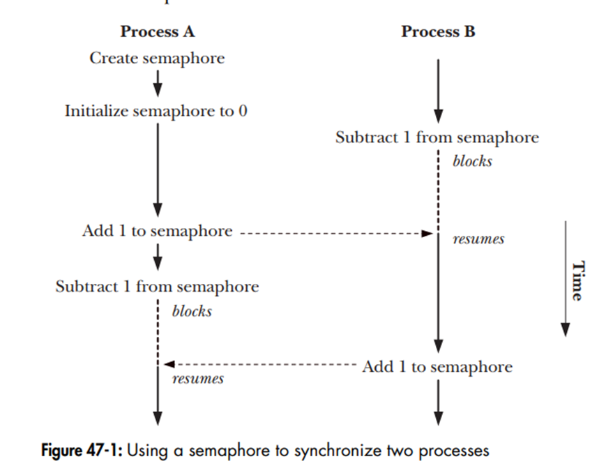

# Lesson 10 - IPC Semaphore

## 1 - Introduction

A semaphore is a synchronization primitive—a counter that processes use to coordinate access to shared resources or order their actions.

Think of a semaphore as a ticket booth at a theater:
- Counter: Number of available tickets (e.g., 1 seat left).
- Processes: Audience members (e.g., Parent, Child 1).
- Actions: Take a ticket (decrement), return a ticket (increment)—controls who enters when.

Unlike message queues (data passing), semaphores manage timing—ensuring one process waits for another to finish a task.

Two Types in POSIX
- Named Semaphores: Identified by a name (e.g., `/mysem`)—great for unrelated processes or across `fork()`.
- Unnamed Semaphores: Stored in shared memory—lighter, for related processes (e.g., threads or `fork()` with shared setup).

## 2 - Semaphore operations

Include `<semaphore.h>` and link with `-lrt`:
- Wait (Decrement): `sem_wait(sem_t *sem);`
    - Decrements count. Blocks if 0—waits until count > 0.
    - Like parking—if no spaces, you wait.
- Post (Increment): `sem_post(sem_t *sem);`
    - Increments count. Unblocks a waiter if any.
    - Like leaving—frees a space.
- Try Wait (Non-Blocking): `sem_trywait(sem_t *sem);`
    - Decrements if count > 0, else returns -1 (`errno = EAGAIN`)—no blocking.
- Get Value: `sem_getvalue(sem_t *sem, int *sval);`
    - Checks current count (e.g., how many spaces left).



## 3 - Named Semaphores

Semaphores with a filesystem-like name (e.g., `/mysem`)—stored in the kernel, accessible by any process that knows the name.

Use for unrelated processes or `fork()`-ed children—no shared memory needed.

- Create/Open:
```c
sem_t *sem_open(const char *name, int oflag, mode_t mode, unsigned int value);
```
`name`: Starts with / (e.g., `/mysem`).  
`oflag`: `O_CREAT` (create if new), `O_EXCL` (fail if exists).  
`mode`: Permissions (e.g., `0644`).  
`value`: Initial count (e.g., 1).  
Returns: `sem_t *` or `SEM_FAILED`.  

- Close: `sem_close(sem_t *sem);`

Closes this process’s handle—semaphore persists.

- Unlink: `sem_unlink(const char *name);`

Deletes semaphore when all processes close it—like `mq_unlink()`.

```c
#include <stdio.h>
#include <unistd.h>
#include <stdlib.h>
#include <fcntl.h>
#include <semaphore.h>

int main() {
    pid_t pid;

    sem_t *sem = sem_open("/mysem", O_CREAT, 0644, 0);  // Start at 0
    if (sem == SEM_FAILED) {
        perror("sem_open");
        return 1;
    }

    pid = fork();
    if (pid < 0) {
        perror("fork");
        return 1;
    }

    if (pid == 0) { // Child
        printf("Child: Hello!\n");
        sem_post(sem);  // Increment (0 → 1)
        sem_close(sem);
        exit(0);
    } else { // Parent
        sem_wait(sem);  // Decrement (1 → 0), waits for Child
        printf("Parent: Hi back!\n");
        wait(NULL);
        sem_close(sem);
        sem_unlink("/mysem");
    }

    return 0;
}
```

## 4 - Unnamed Semaphores

Semaphores without a name—stored in memory you provide (e.g., shared between processes via `mmap()` or pre-`fork()`).

Use for related processes (e.g., threads, or `fork()` with shared memory)—lighter, no kernel name overhead.

- Initialize:
```c
int sem_init(sem_t *sem, int pshared, unsigned int value);
```

`sem`: Pointer to sem_t in shared memory.
`pshared`: 0 (threads only), 1 (processes sharing memory).
`value`: Initial count.
Returns: 0 (success), -1 (error).

- Destroy: `sem_destroy(sem_t *sem);`

Frees resources—call when done (no unlink needed).

Setup for Processes
- Challenge: Unnamed semaphores need shared memory—pre-`fork()` (global) or via `mmap()`.
- Simple Way: Define sem_t globally, set pshared = 1, use post-`fork()`.

```c
#include <stdio.h>
#include <unistd.h>
#include <stdlib.h>
#include <semaphore.h>

sem_t sem;  // Global, shared post-fork

int main() {
    pid_t pid;

    if (sem_init(&sem, 1, 0) == -1) {  // pshared=1, start at 0
        perror("sem_init");
        return 1;
    }

    pid = fork();
    if (pid < 0) {
        perror("fork");
        return 1;
    }

    if (pid == 0) { // Child
        printf("Child: Hello!\n");
        sem_post(&sem);  // Increment (0 → 1)
        sem_destroy(&sem);  // Optional, per process
        exit(0);
    } else { // Parent
        sem_wait(&sem);  // Decrement (1 → 0), waits for Child
        printf("Parent: Hi back!\n");
        wait(NULL);
        sem_destroy(&sem);
    }

    return 0;
}
```

Named vs. Unnamed: Comparison

|Feature|	Named|	Unnamed|
|-------|--------|---------|
|Identifier|	Name (e.g., /mysem)|	Memory address|
|Creation|	sem_open()	|sem_init()|
|Cleanup|	sem_close(), sem_unlink()|	sem_destroy()|
|Use Case|	Unrelated processes, fork|	Threads, related processes|
|Overhead|	Kernel-managed|	Lighter, memory-based|
|Setup|	Simple—name-based|	Needs shared memory|
