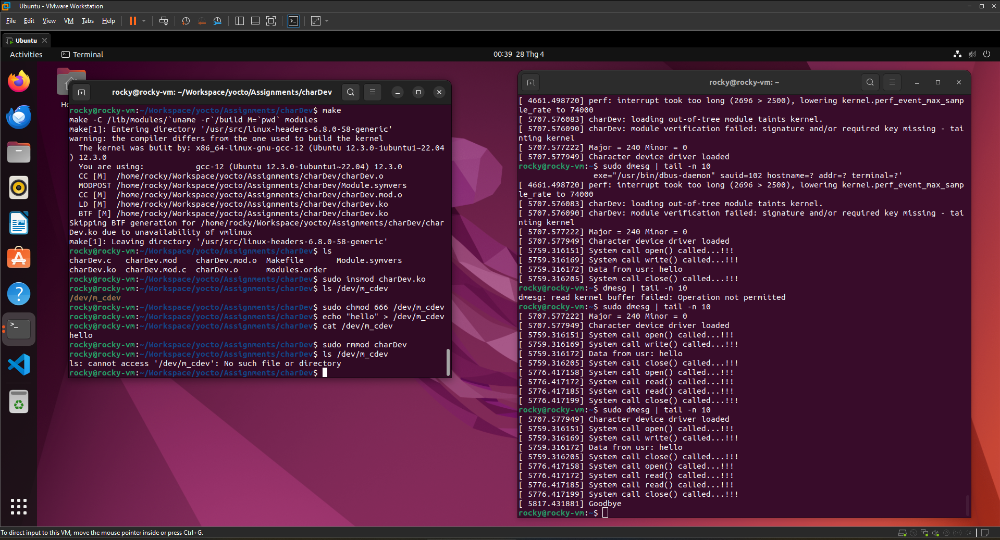

# Character device driver assignment

- Create a character device (a special file like `/dev/m_cdev`) that user programs can interact with.
- Allow user programs to send data to the kernel by writing to the device (e.g., `echo "hello" > /dev/m_cdev`).
- Allow user programs to read data from the kernel by reading from the device (e.g., `cat /dev/m_cdev` outputs “hello”).

The code is a Linux kernel module that:
- Creates a character device named /dev/m_cdev.
- Allocates a kernel buffer to store data.
- Defines operations (open, read, write, release) to handle user interactions with /dev/m_cdev.
- When a user writes data (e.g., “hello”) to /dev/m_cdev, the driver stores it in the kernel buffer.
- When a user reads from /dev/m_cdev, the driver returns the stored data.
- The module can be loaded (insmod) and unloaded (rmmod), with proper setup and cleanup.

Code explain

```c
#include <linux/module.h>   /* Define module_init(), module_exit() */
#include <linux/fs.h>       /* Define alloc_chrdev_region(), register_chrdev_region() */
#include <linux/device.h>   /* Define device_create(), class_create() */
#include <linux/cdev.h>     /* Define cdev_init(), cdev_add() */
#include <linux/uaccess.h>  /* Define copy_to_user(), copy_from_user() */
#include <linux/slab.h>     /* Define kfree() */
```

- `<linux/module.h>`: Needed for kernel module basics (e.g., module_init, module_exit).
- `<linux/fs.h>`: Provides functions to register character devices (e.g., alloc_chrdev_region).
- `<linux/device.h>`: Allows creating device files (e.g., /dev/m_cdev).
- `<linux/cdev.h>`: Defines the character device structure and operations (e.g., cdev_add).
- `<linux/uaccess.h>`: Enables safe data transfer between user space and kernel space (copy_to_user, copy_from_user).
- `<linux/slab.h>`: Provides memory allocation functions (kmalloc, kfree) for the kernel buffer.


```c
#define DRIVER_AUTHOR "Phuc"
#define DRIVER_DESC   "Read and write data from and to kernel"
#define DRIVER_VERS   "1.0"
#define NPAGES  1
```
Macros defining metadata and constants.
- `DRIVER_AUTHOR`, `DRIVER_DESC`, `DRIVER_VERS`: Used in module metadata to describe the module (visible in modinfo).
- `NPAGES`: Sets the size of the kernel buffer to 1 page (typically 4KB, the kernel’s memory page size). This limits how much data the driver can store.

```c
struct m_foo_dev {
    int32_t size;
    char *kmalloc_ptr;
    dev_t dev_num;
    struct class *m_class;
    struct cdev m_cdev;
} mdev;
```
Defines a structure `m_foo_dev` to store the device’s state and declares a global instance `mdev`.
- `size`: Tracks the amount of data stored in the buffer.
- `kmalloc_ptr`: Pointer to the kernel buffer where user data is stored (e.g., “hello”).
- `dev_num`: Stores the device’s major and minor numbers (type `dev_t`).
- `m_class`: Stores the device class for creating `/dev/m_cdev`.
- `m_cdev`: Stores the character device structure for handling operations.
- `mdev`: A single global instance of the structure, representing one device.

```c
static int m_open(struct inode *inode, struct file *file)
{
    pr_info("System call open() called...!!!\n");
    return 0;
}
```
Called when a user program opens the device (e.g., `cat /dev/m_cdev`).
- Allows the driver to initialize resources or check permissions when the device is accessed.
- Here, it just prints a log message using `pr_info` (visible with `dmesg`).
- Returns 0 to indicate success (non-zero would indicate failure).
- This is a placeholder—real drivers might allocate resources or set up hardware.

```c
static int m_release(struct inode *inode, struct file *file)
{
    pr_info("System call close() called...!!!\n");
    return 0;
}
```
Called when a user program closes the device (e.g., after `cat /dev/m_cdev` finishes).
- Cleans up resources or resets state when the device is no longer in use.
- Here, it just logs a message and returns 0 (success).
- Like `m_open`, it’s a placeholder for future functionality.

```c
static ssize_t m_read(struct file *filp, char __user *user_buf, size_t size, loff_t *offset)
{
    size_t to_read;
    pr_info("System call read() called...!!!\n");
    to_read = (size > mdev.size - *offset) ? (mdev.size - *offset) : size;
    if (copy_to_user(user_buf, mdev.kmalloc_ptr + *offset, to_read))
        return -EFAULT;
    *offset += to_read;
    return to_read;
}
```
Called when a user program reads from the device (e.g., `cat /dev/m_cdev`).
- Sends data from the kernel buffer (`mdev.kmalloc_ptr`) to the user program.
- Parameters:
    - `filp`: File pointer (not used here).
    - `user_buf`: User-space buffer to copy data to.
    - `size`: Number of bytes the user wants to read.
    - `offset`: Current position in the buffer (tracks how much has been read).
- `to_read`: Calculates how many bytes to read (either the requested size or the remaining data mdev.size - *offset).
- `copy_to_user`: Safely copies `to_read` bytes from `mdev.kmalloc_ptr + *offset` to `user_buf`. Returns non-zero on error, causing -EFAULT.
- `*offset += to_read`: Updates the position for the next read.
- Returns `to_read` (bytes read) or `-EFAULT` (error).

```c
static ssize_t m_write(struct file *filp, const char *user_buf, size_t size, loff_t *offset)
{
    size_t to_write;
    pr_info("System call write() called...!!!\n");
    to_write = (size + *offset > NPAGES * PAGE_SIZE) ? (NPAGES * PAGE_SIZE - *offset) : size;
    memset(mdev.kmalloc_ptr, 0, NPAGES * PAGE_SIZE);
    if (copy_from_user(mdev.kmalloc_ptr + *offset, user_buf, to_write) != 0)
        return -EFAULT;
    pr_info("Data from usr: %s", mdev.kmalloc_ptr);
    *offset += to_write;
    mdev.size = *offset;
    return to_write;
}
```
Called when a user program writes to the device (e.g., e`cho "hello" > /dev/m_cdev`).
- Stores data from the user program in the kernel buffer (`mdev.kmalloc_ptr`).
- Parameters:
    - `filp`: File pointer (not used).
    - `user_buf`: User-space buffer containing data to write.
    - `size`: Number of bytes to write.
    - `offset`: Current position in the buffer.
- `to_write`: Limits the write size to avoid buffer overflow (`NPAGES * PAGE_SIZE`).
- `memset`: Clears the entire buffer to zero before writing (this is a design choice but means each write overwrites previous data).
- `copy_from_user`: Copies `to_write` bytes from `user_buf` to `mdev.kmalloc_ptr + *offset`. Returns non-zero on error, causing `-EFAULT`.
- `pr_info("Data from usr: %s", ...)`: Logs the written data.
- `*offset += to_write`: Updates the position.
- `mdev.size = *offset`: Tracks the total data size.
- Returns `to_write` (bytes written) or `-EFAULT` (error).

```c
static struct file_operations fops = {
    .owner = THIS_MODULE,
    .read = m_read,
    .write = m_write,
    .open = m_open,
    .release = m_release,
};
```
Defines the file operations structure (`fops`) that links user actions to driver functions.
- Tells the kernel which functions to call when the device is accessed.
- `.owner = THIS_MODULE`: Prevents the module from unloading while the device is in use.
- `.read = m_read`: Calls m_read for read operations.
- `.write = m_write`: Calls m_write for write operations.
- `.open = m_open`, `.release = m_release`: Handle open/close.
- This is the core of the character device driver, enabling user interaction.

```c
static int __init chdev_init(void) {
    if (alloc_chrdev_region(&mdev.dev_num, 0, 1, "m_cdev") < 0) {
        pr_err("Failed to alloc chrdev region\n");
        return -1;
    }
    pr_info("Major = %d Minor = %d\n", MAJOR(mdev.dev_num), MINOR(mdev.dev_num));
```
Allocates a major and minor number for the device.
- `alloc_chrdev_region`: Dynamically assigns a major/minor number for the device named “m_cdev” (visible in `/proc/devices`).
- Stores the number in `mdev.dev_num`.
- Prints the major/minor numbers for debugging.
- If allocation fails, logs an error and returns -1 (module load fails).

```c
    if ((mdev.m_class = class_create("m_class")) == NULL)
    {
        pr_err("Cannot create the struct class for my device\n");
        goto rm_device_numb;
    }
```
A `class` in the Linux kernel is a way to group devices with similar characteristics or functionality. It’s part of the kernel’s device model, which organizes devices in a hierarchical structure for management and user-space interaction.
- In `charDev.c`, the class (`m_class`) is used to create a device class for your character device (`/dev/m_cdev`).
- The class allows the kernel to automatically create a device file (`/dev/m_cdev`) when the driver is loaded, making it accessible to user-space programs (e.g., echo, cat).
- It also integrates the device into the `/sys/class/` hierarchy, visible as `/sys/class/m_class/m_cdev`, which user-space tools (like udev) can use to manage the device.

Change in `class_create`
- Old API (pre-5.14): `class_create(THIS_MODULE, "m_class")` passed module owner and name.
- New API (5.14+, including 6.8.0): `class_create("m_class")` passes only the name, as the kernel handles ownership internally.

Creates a device class (“m_class”).
- A class groups devices and is needed to create the device file `/dev/m_cdev`.
- Stores the class in `mdev.m_class`.
- If it fails, jumps to `rm_device_numb` to clean up (`unregister_chrdev_region`).

```c
    if ((device_create(mdev.m_class, NULL, mdev.dev_num, NULL, "m_cdev")) == NULL) {
        pr_err("Cannot create my device\n");
        goto rm_class;
    }
```
Creates the device file `/dev/m_cdev`.
- Links the device to `mdev.dev_num` and places it under the “m_class” class.
- Makes `/dev/m_cdev` visible to user programs.
- If it fails, jumps to `rm_class` to clean up (`class_destroy`).

```c
    cdev_init(&mdev.m_cdev, &fops);
    if ((cdev_add(&mdev.m_cdev, mdev.dev_num, 1)) < 0) {
        pr_err("Cannot add the device to the system\n");
        goto rm_device;
    }
```
Initializes and registers the character device.
- `cdev_init`: Links the `fops` (file operations) to `mdev.m_cdev`.
- `cdev_add`: Registers `mdev.m_cdev` with the kernel, associating it with `mdev.dev_num`.
- If it fails, jumps to `rm_device` to clean up (`device_destroy`).
- Activates the character device, enabling user interactions via `/dev/m_cdev`.

```c
    pr_info("Hello world kernel module\n");
    return 0;
```
Logs success and indicates the module loaded correctly.
- `return 0` tells the kernel the module initialized successfully.
- The log message confirms the driver is ready.

```c
rm_device:
    device_destroy(mdev.m_class, mdev.dev_num);
rm_class:
    class_destroy(mdev.m_class);
rm_device_numb:
    unregister_chrdev_region(mdev.dev_num, 1);
    return -1;
```
Cleanup labels for error handling.
- If any step fails (e.g., class_create), the code jumps to the appropriate label to undo previous steps.
- Ensures no resources are leaked if initialization fails.
- `Returns -1` to indicate module load failure.

```c
static void __exit chdev_exit(void) {
    kfree(mdev.kmalloc_ptr);
    cdev_del(&mdev.m_cdev);
    device_destroy(mdev.m_class, mdev.dev_num);
    class_destroy(mdev.m_class);
    unregister_chrdev_region(mdev.dev_num, 1);
    pr_info("Goodbye\n");
}
```
Cleans up when the module is unloaded (`rmmod`).
- `kfree(mdev.kmalloc_ptr)`: Frees the kernel buffer (Note: The code assumes kmalloc_ptr was allocated, but allocation isn’t shown—likely a bug or done earlier).
- `cdev_del`: Removes the character device.
- `device_destroy`: Removes `/dev/m_cdev`.
- `class_destroy`: Removes the device class.
- `unregister_chrdev_region`: Frees the major/minor number.
- Logs “Goodbye” to confirm unloading.

```c
module_init(chdev_init);
module_exit(chdev_exit);

MODULE_LICENSE("GPL");
MODULE_AUTHOR(DRIVER_AUTHOR);
MODULE_DESCRIPTION(DRIVER_DESC);
MODULE_VERSION(DRIVER_VERS);
```
Registers the module’s entry/exit points and metadata.
- `module_init(chdev_init)`: Runs chdev_init when the module is loaded.
- `module_exit(chdev_exit)`: Runs chdev_exit when unloaded.
- `MODULE_LICENSE("GPL")`: Specifies the GPL license (required for kernel compatibility).
- `MODULE_AUTHOR`, `MODULE_DESCRIPTION`, `MODULE_VERSION`: Provide module info (visible with `modinfo`).

## Test result



Load the Module:
- Load charDev.ko into the kernel:
```bash
sudo insmod charDev.ko
```

Check kernel logs:
```bash
dmesg | tail -n 10
```

Check if `/dev/m_cdev` was created:
```bash
ls /dev/m_cdev
```

By default, `/dev/m_cdev` may be root-only. To allow your user to access it:
```bash
sudo chmod 666 /dev/m_cdev
```

Write data to `/dev/m_cdev`
```bash
echo "hello" > /dev/m_cdev
```

Check kernel logs:
```bash
dmesg | tail -n 10
```
Look for:
- “System call write() called...”
- “Data from usr: hello”

Read from `/dev/m_cdev`
```bash
cat /dev/m_cdev
```
Look for “System call read() called...”.

Remove the module:
```bash
sudo rmmod charDev
```

Check kernel logs:
```bash
dmesg | tail -n 10
```
Look for “Goodbye”.

Verify /dev/m_cdev is gone
```bash
ls /dev/m_cdev
```
