# Sensor Monitoring System

## Table of Contents
- [Sensor Monitoring System](#sensor-monitoring-system)
  - [Table of Contents](#table-of-contents)
  - [Project Overview](#project-overview)
  - [Project Structure](#project-structure)
  - [Key Components and Functionalities](#key-components-and-functionalities)
    - [Processes](#processes)
    - [Threads](#threads)
    - [Sensor Nodes](#sensor-nodes)
    - [Data Structures](#data-structures)
      - [Ring Buffer](#ring-buffer)
      - [Connection Management](#connection-management)
    - [Keep-Alive Mechanism](#keep-alive-mechanism)
    - [Data Management](#data-management)
    - [Storage Management](#storage-management)
    - [Average Temperature Calculation](#average-temperature-calculation)
    - [Logging](#logging)
    - [Database](#database)
  - [How to Build and Run](#how-to-build-and-run)
    - [1. Prerequisites](#1-prerequisites)
    - [2. Build](#2-build)
    - [3. Run](#3-run)
    - [4. Check Outputs:](#4-check-outputs)
  - [Example Workflow](#example-workflow)
    - [1. Start](#1-start)
    - [2. Sensor Connects:](#2-sensor-connects)
    - [3. Data Processing](#3-data-processing)
    - [4. Storage](#4-storage)
    - [5. Keep-Alive](#5-keep-alive)
    - [6. Shutdown](#6-shutdown)
  - [Dependencies](#dependencies)
  - [Contributing](#contributing)
  - [License](#license)

## Project Overview

The Sensor Monitoring System is a server application that:

- Receives temperature data from sensor nodes (devices) over TCP connections.
- Processes the data to calculate running averages and detect anomalies (e.g., too hot or too cold).
- Stores the data in a SQLite database.
- Logs all activities to a file for debugging and monitoring.
- Manages connections to ensure sensors stay connected or are gracefully disconnected if they timeout.
- Imagine you have temperature sensors in a factory. This system collects their readings, checks if they’re too hot or cold, saves them for later analysis, and logs everything that - happens, like a digital notebook.

Example:

- A sensor in a freezer sends a temperature of 16.9°C.
- The system logs: "Received data: sensor_id=1, temp=16.9°C".
- It calculates the average temperature over time.
- If the average drops below 18°C, it prints: "Sensor 1 too cold (avg temp 16.9°C)".
- The data is saved to a database for future reference.


## Project Structure

The project is organized into source files, each handling a specific part of the system. Here’s the layout:

```
XX-SensorMonitoringSystem/
├── include/
│   └── common.h        # Shared constants and types (e.g., MAX_SENSORS)
├── src/
│   ├── connection_manager.c  # Manages sensor connections
│   ├── connection_manager.h
│   ├── data_manager.c       # Processes sensor data and averages
│   ├── data_manager.h
│   ├── keep_alive.c         # Monitors sensor connectivity
│   ├── keep_alive.h
│   ├── log.c                # Handles logging to file
│   ├── log.h
│   ├── main.c               # Entry point, starts processes and threads
│   ├── sbuffer.c            # Implements the ring buffer
│   ├── sbuffer.h
│   ├── storage_manager.c    # Stores data in SQLite database
│   ├── storage_manager.h
│   ├── threads.c            # Creates and manages threads
│   ├── threads.h
├── db/
│   └── sensors.db           # SQLite database (created at runtime)
├── logs/
│   └── gateway.log          # Log file for events
├── Makefile                 # Build instructions
└── README.md                # This file
```

**Diagram:**

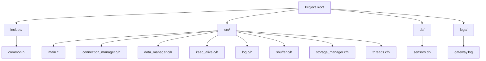

## Key Components and Functionalities

### Processes
The system uses two processes (like separate programs running together):
- Main Process: Runs the core application, managing sensor connections, data processing, and storage.
- Log Process: A child process that reads events from a FIFO (named pipe) and writes them to `logs/gateway.log`.

How It Works:
- The `main.c` file starts the main process.
- It uses fork() to create the log process, which runs log_process_run from `log.c`.
- The main process communicates with the log process via a FIFO (`/tmp/logFifo`).

Example:
- You start the program: `./sensor_gateway 1234`.
- `main.c` forks a child process.
- The child process opens `/tmp/logFifo`, reads messages like "Sensor gateway started", and writes to `gateway.log`:

```
1 Mon Apr 14 01:09:30 2025 Sensor gateway started on port 1234
```

**Diagram:**

```mermaid
graph TD
    A[main.c] -->|fork()| B[Main Process]
    A -->|fork()| C[Log Process]
    B -->|Writes to FIFO| D[/tmp/logFifo]
    C -->|Reads from FIFO| D
    C -->|Writes| E[logs/gateway.log]
```

### Threads
The main process creates three threads (like workers within the program) to handle different tasks concurrently:
1. Connection Manager Thread (`connection_manager.c`): Accepts sensor connections and receives data.
2. Data Manager Thread (`data_manager.c`): Processes data and calculates averages.
3. Storage Manager Thread (`storage_manager.c`): Saves data to the database.

How It Works:
- `threads.c` creates these threads using `pthread_create`.
- Each thread runs a function (`connection_manager`, `data_manager`, `storage_manager`).
- They share a ring buffer (`sbuffer_t`) to pass data between them.

Example:
- A sensor connects on port 1234.
- The connection manager thread accepts it and puts data into the ring buffer.
- The data manager thread reads from the buffer, calculates the average, and checks if it’s too cold.
- The storage manager thread reads from the buffer and saves to `sensors.db`.

**Diagram:**

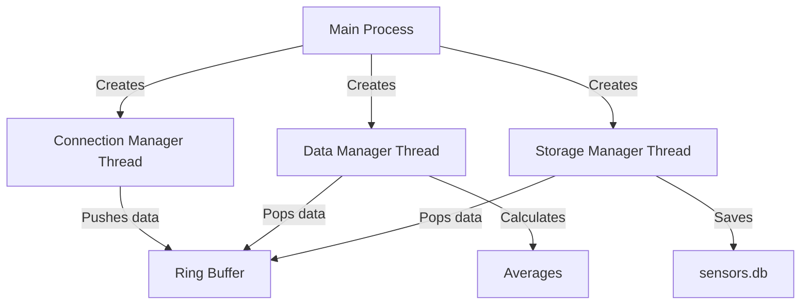

### Sensor Nodes
Sensor nodes are external devices (or simulated clients) that connect to the server via TCP and send temperature data.

How It Works:
- Each sensor connects to the server’s IP and port (e.g., `localhost:1234`).
- It sends a `sensor_data_t` struct containing:
  - `sensor_id`: A unique ID (e.g., 1).
  - `temperature`: The temperature reading (e.g., 16.9°C).
  - `timestamp`: The time of the reading.
- The server assigns a connection ID (file descriptor, e.g., 6) to track the TCP socket.

Example:

- A sensor client runs:

```c
struct sensor_data_t {
    int sensor_id;
    float temperature;
    time_t timestamp;
} data = {1, 16.9, time(NULL)};
write(socket, &data, sizeof(data));
```

- The server receives it, logs:
```
Received data: sensor_id=1, temp=16.9, time=1744568370
```

- Terminal shows:

```
Mon Apr 14 01:09:30 2025: Connection 6 established
```

**Diagram:**

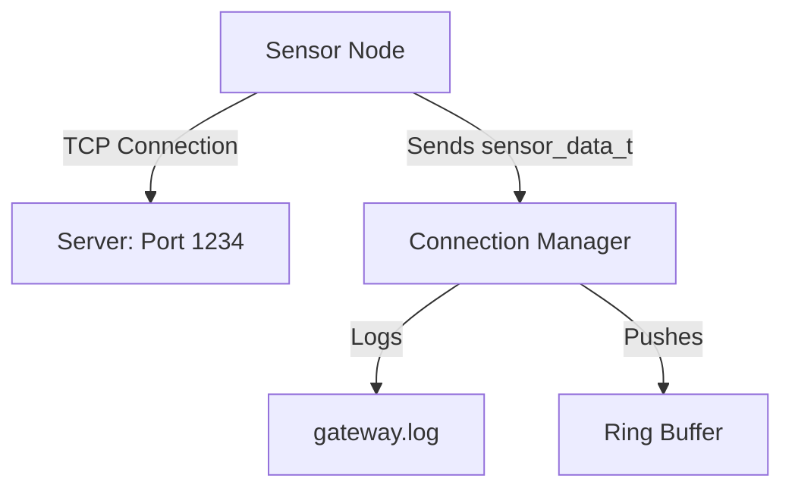

### Data Structures
The project uses several structs to manage data:

1. `sensor_data_t` (`sbuffer.h`)

- Holds a single sensor reading.
```c
typedef struct {
    int sensor_id;    // e.g., 1
    float temperature; // e.g., 16.9
    time_t timestamp; // e.g., 1744568370
} sensor_data_t;
```
Example:
- A sensor sends: `{sensor_id=1, temperature=16.9, timestamp=1744568370}`.
- Used to pass data from sensors to the ring buffer.

2. `sbuffer_t` (`sbuffer.h`)

- The ring buffer storing sensor data.

```c
typedef struct {
    sensor_data_t *buffer; // Array of sensor_data_t
    int size;             // Max elements (MAX_SENSORS)
    int head;             // Where to add data
    int tail;             // Where to remove data
    int count;            // Current number of elements
    pthread_mutex_t mutex; // Thread safety
    pthread_cond_t not_full; // Signal when not full
    pthread_cond_t not_empty; // Signal when not empty
} sbuffer_t;
```

Example:
- Buffer size = 50 (`MAX_SENSORS`).
- Stores `{1, 16.9, ...}`,` {1, 17.0, ...}`, etc.

3. `sensor_avg_t` (`data_manager.h`):
Tracks running average for each sensor.

```c
typedef struct {
    float sum;        // Sum of temperatures
    int count;        // Number of readings
    time_t last_update; // Last update time
} sensor_avg_t;
```

Example:
- For sensor_id=1: `{sum=33.9, count=2, last_update=1744568375}`.
- Average = `33.9 / 2 = 16.95°C`.

4. `connection_tracking_t` (`keep_alive.h`):
Monitors sensor connections.

```c
typedef struct {
    int connection_id; // File descriptor, e.g., 6
    char ip[16];      // Sensor IP (not used here)
    int port;         // Sensor port (not used)
    time_t last_active; // Last data time
    int active;       // 1 if connected, 0 if not
} connection_tracking_t;
```
Example:
- `{connection_id=6, ip="", port=0, last_active=1744568370, active=1}`.

**Diagram:**

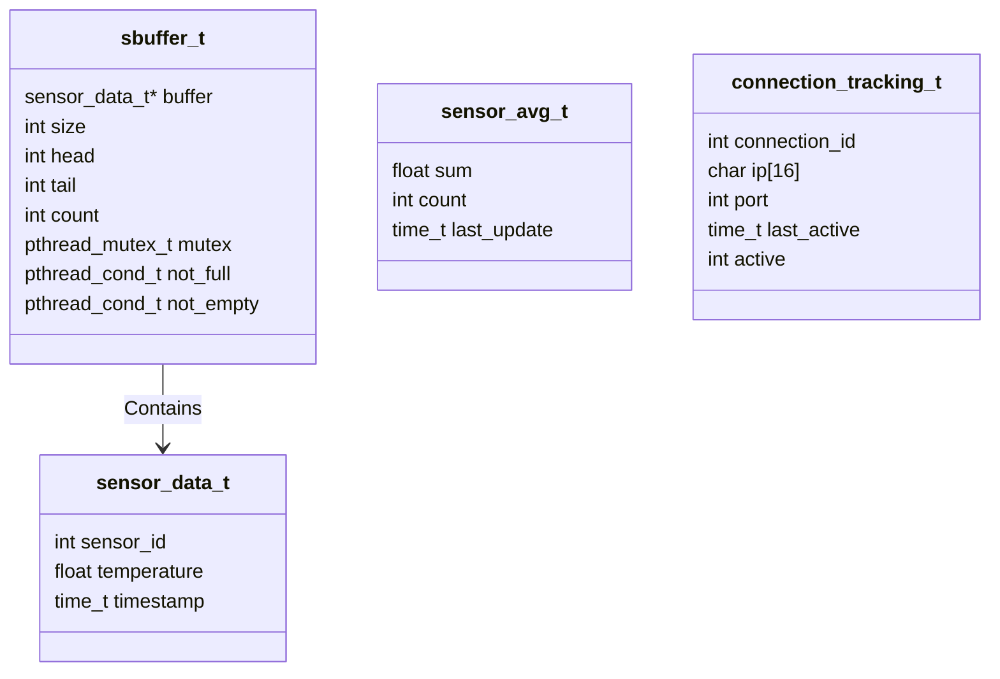

#### Ring Buffer
The ring buffer (sbuffer.c) is a circular queue that temporarily stores sensor data, allowing threads to share data safely.

How It Works:

- Defined as `sbuffer_t`, with a fixed size (`MAX_SENSORS`).
- Push: Connection manager adds data at `head`.
- Pop: Data and storage managers remove data from `tail`.
- Thread-safe using a mutex and condition variables (`not_full`, `not_empty`).
- If full, it overwrites the oldest data.

Example:

- Buffer size = 50.
- Connection manager pushes: `{1, 16.9, ...}`.
- `head` moves forward, `count` increases.
- Data manager pops: `{1, 16.9, ...}`, `tail` moves, `count` decreases.

Log:
```
Data pushed to buffer
Data popped from buffer
```

**Diagram:**

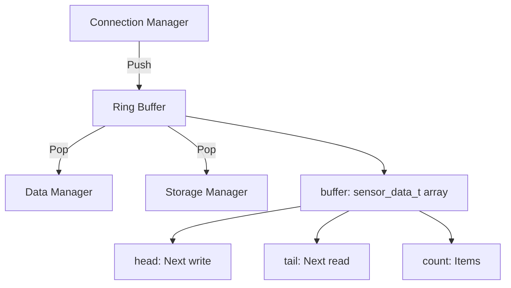

#### Connection Management
The connection manager (`connection_manager.c`) handles sensor connections via TCP.

How It Works:
- Listens on a port (e.g., 1234) using a socket.
- Accepts connections, assigning each a file descriptor (e.g., 6).
- Reads `sensor_data_t` from sensors and pushes to the ring buffer.
- Closes connections if sensors disconnect or error.

Example:

- Sensor connects to `localhost:1234`.
- Server assigns `client_fd=6`

Log:
```
A sensor node with 6 has opened a new connection
```

Terminal:
```
Mon Apr 14 01:09:30 2025: Connection 6 established
```

Sensor sends `{1, 16.9, ...}`, logged:
```
Received data: sensor_id=1, temp=16.9, time=...
```

**Diagram:**
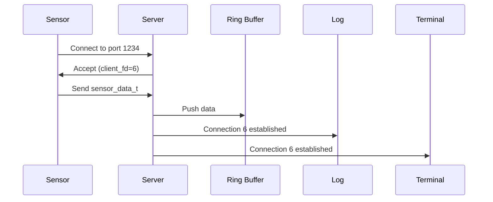

### Keep-Alive Mechanism
The keep-alive (`keep_alive.c`) ensures sensors are still connected by checking their activity.

How It Works:
- Monitors `connection_tracking_t` array for each sensor.
- If no data is received within `TIMEOUT_SECONDS` (e.g., 60 seconds), it marks the connection inactive and closes it.
- Runs in the main process (not a separate thread).

Example:

- Sensor with `client_fd=6` sends data at t=0.
- At t=70s, no new data:
    - `time(NULL) - last_active > 60`, so disconnect.
    - Log:

    ```
    Sensor node with 6 has disconnected (keep-alive timeout)
    ```
    - Terminal
    ```
    Mon Apr 14 01:10:40 2025: Connection 6 closed (timeout)
    ```

**Diagram:**
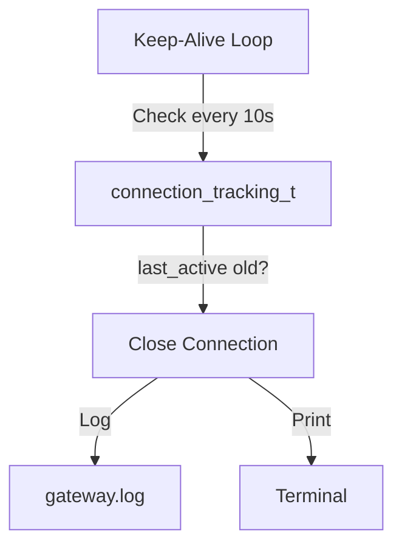

### Data Management
The data manager (`data_manager.c`) processes sensor data, calculates averages, and triggers alerts.

How It Works:

- Pops `sensor_data_t` from the ring buffer.
- Validates `sensor_id` (1 to M`AX_SENSORS-1`).
- Updates running average for each sensor.
- Checks if average is too cold (<18°C) or too hot (>40°C).
- Alerts after MI`N_AVG_COUNT=5` readings, once every `ALERT_COOLDOWN=60` seconds.

Example:

- Readings for s`ensor_id=1`:
  - t=0: 16.9°C
  - t=5: 17.0°C
  - t=10: 16.8°C
  - t=15: 17.1°C
  - t=20: 16.7°C

- First 4 readings:
  - Log: "Sensor 1 accumulating: 16.9°C (count=1, waiting for 5)"

- At t=20 (5th reading):
  - `sum = 16.9 + 17.0 + 16.8 + 17.1 + 16.7 = 84.5`
  - `count = 5`
  - `avg = 84.5 / 5 = 16.9°C`
  - Alert: "Sensor 1 too cold (avg temp 16.9°C)"
  - Log:
  ```
  Sensor 1 running avg: 16.9°C (count=5)
  The sensor node with 1 reports it's too cold (running avg temperature = 16.9)
  ```

**Diagram:**

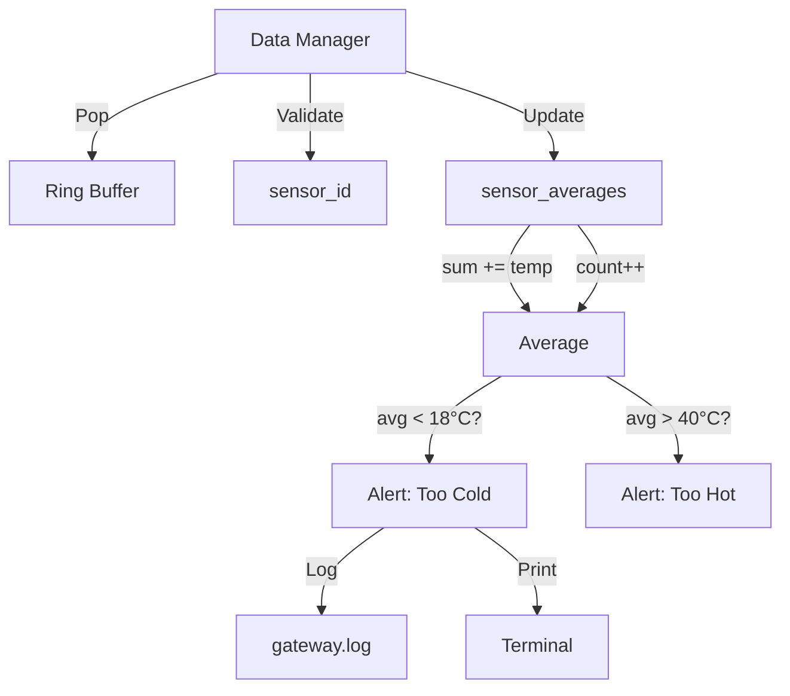

### Storage Management
The storage manager (`storage_manager.c`) saves sensor data to a SQLite database.

How It Works:
- Pops `sensor_data_t` from the ring buffer.
- Opens `db/sensors.db` and creates a measurements table if needed.
- Inserts data: `id` (sensor_id), `temp` (temperature), `time` (timestamp).
- Retries up to `MAX_RETRIES` (3) if operations fail.

Example:

- Data: `{sensor_id=1, temperature=16.9, timestamp=1744568370}`
- SQL
```sql
INSERT INTO measurements VALUES (1, 16.9, 1744568370);
```

- Log:
```text
Inserted a row to SQL table
```

- Database:
```sql
sqlite> SELECT * FROM measurements;
1|16.9|1744568370
```

**Diagram**
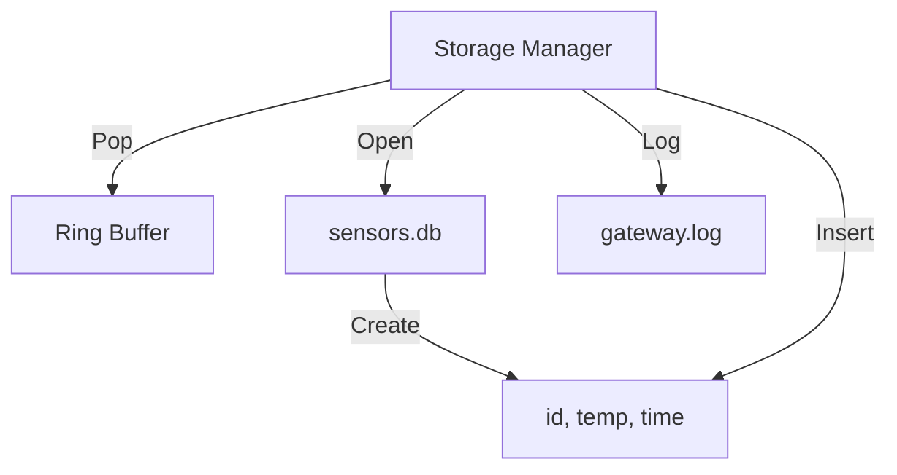

### Average Temperature Calculation

The average temperature is calculated per sensor in `data_manager.c`.

How It Works:

- Tracks `sum` and `count` in `sensor_averages[sensor_id]`.
- Reset: If no data for 1 hour (`RESET_THRESHOLD_SECONDS=3600`):
  - `sum = new_temperature`
  - `count = 1`
- Update: Otherwise:
  - `sum += new_temperature`
  - `count++`
- Average: `avg = sum / count`
- Requires `MIN_AVG_COUNT=5` readings before averaging or alerting.
- Alerts throttled to every `ALERT_COOLDOWN=60` seconds.

Example:

- Sensor 1 sends:
  - t=0: 16.9°C (sum=16.9, count=1)
  - t=5: 17.0°C (sum=33.9, count=2)
  - t=10: 16.8°C (sum=50.7, count=3)
  - t=15: 17.1°C (sum=67.8, count=4)
  - t=20: 16.7°C (sum=84.5, count=5)
- At t=20:
  - `avg = 84.5 / 5 = 16.9°C`
  - Alert: "Sensor 1 too cold (avg temp 16.9°C)"
- t=80: 16.6°C (`sum=101.1`, `count=6`)
  - `avg = 101.1 / 6 = 16.85°C`
  - Alert (after 60s cooldown): "Sensor 1 too cold (avg temp 16.85°C)"

**Diagram:**
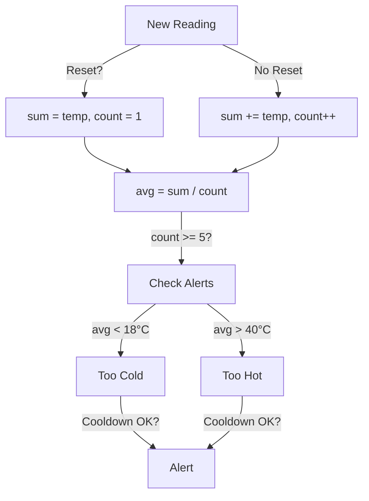

### Logging
The logging system (`log.c`) records all events to `logs/gateway.log`.

How It Works:

- Uses a FIFO (`/tmp/logFifo`) to send messages from the main process to the log process.
- Log process writes: `seq_num timestamp message`.
- Thread-safe with a mutex.
- Logs everything: connections, data, averages, errors, etc.

Example:
- Sensor connects:
  - Main process: `log_event("A sensor node with 6 has opened a new connection")`
  - Log process writes:
  ```text
  1 Mon Apr 14 01:09:30 2025 A sensor node with 6 has opened a new connection
  ```

**Diagram:**
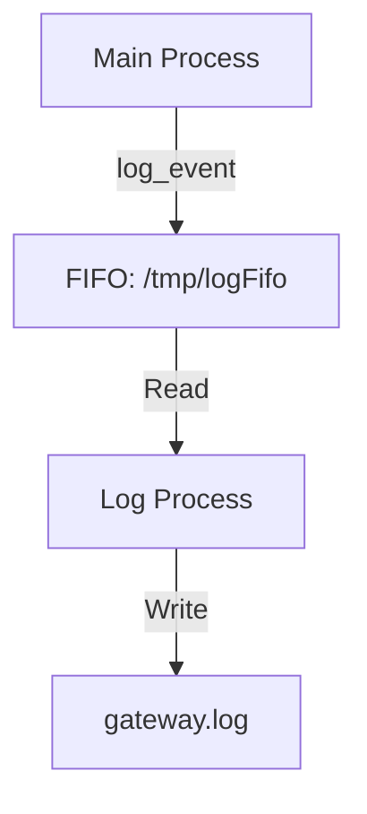

### Database
The database (`storage_manager.c`) uses SQLite to store sensor data in `db/sensors.db`.

How It Works:
- Table `measurements`
```sql
CREATE TABLE measurements (
    id INTEGER NOT NULL,    -- sensor_id
    temp REAL NOT NULL,     -- temperature
    time INTEGER NOT NULL   -- timestamp
);
```
- Inserts one row per reading.
- Created at runtime if it doesn’t exist.

Example:

- Data: `{1, 16.9, 1744568370}`
- Insert:
```sql
INSERT INTO measurements VALUES (1, 16.9, 1744568370);
```

- Query:
```bash
sqlite3 db/sensors.db "SELECT * FROM measurements;"
```

Output:
```text
1|16.9|1744568370
```

**Diagram:**
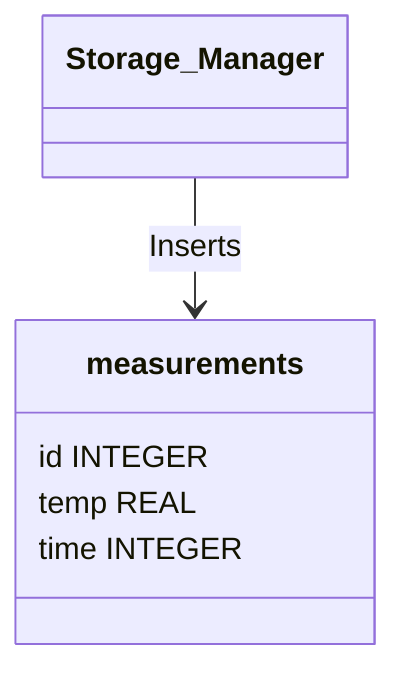

## How to Build and Run
### 1. Prerequisites
- GCC
- SQLite3 (`libsqlite3-dev` on Ubuntu)
- Make

```bash
sudo apt update
sudo apt install gcc make libsqlite3-dev
```

### 2. Build
```bash
make clean && make
```

### 3. Run
```bash
./sensor_gateway 1234
```
Listens on port 1234.

### 4. Check Outputs:
- Terminal: Alerts like "Sensor 1 too cold".
- Log: `cat logs/gateway.log`
- Database:` sqlite3 db/sensors.db "SELECT * FROM measurements;"`


## Example Workflow
### 1. Start

```bash
./sensor_gateway 1234
```

Terminal:
```text
Mon Apr 14 01:09:30 2025: Sensor gateway started on port 1234
Mon Apr 14 01:09:30 2025: Connected to database db/sensors.db
Mon Apr 14 01:09:30 2025: Table measurements ready
```

### 2. Sensor Connects:
- Client sends `{1, 16.9, ...}`.
- Terminal

```bash
Mon Apr 14 01:09:30 2025: Connection 6 established
```

- Log

```bash
A sensor node with 6 has opened a new connection
Received data: sensor_id=1, temp=16.9, time=...
```

### 3. Data Processing
- Five readings: 16.9, 17.0, 16.8, 17.1, 16.7°C.
- Log:
```text
Sensor 1 accumulating: 16.9°C (count=1, waiting for 5)
...
Sensor 1 running avg: 16.9°C (count=5)
The sensor node with 1 reports it's too cold (running avg temperature = 16.9)
```
- Terminal:
```text
Mon Apr 14 01:09:30 2025: Sensor 1 too cold (avg temp 16.9°C)
```

### 4. Storage
- Storage:
```text
1|16.9|1744568370
1|17.0|1744568375
...
```

### 5. Keep-Alive
- Sensor stops at t=70s.
- Terminal:
```bash
Mon Apr 14 01:10:40 2025: Connection 6 closed (timeout)
```

### 6. Shutdown
- Press ```Ctrl+C```
- Terminal
```bash
Shutdown signal received
Mon Apr 14 01:10:50 2025: Sensor gateway shut down successfully
```

## Dependencies
- SQLite3: For database storage (`libsqlite3-dev`).
- POSIX Threads: For threading (`pthread`).
- Standard C Libraries: For sockets, time, etc.

## Contributing
Feel free to fork the project, submit pull requests, or report issues.
- Try adding a new feature, like logging humidity data.
- Improve error handling or documentation.

## License
This project is open-source under the MIT License. See `LICENSE` for details.
